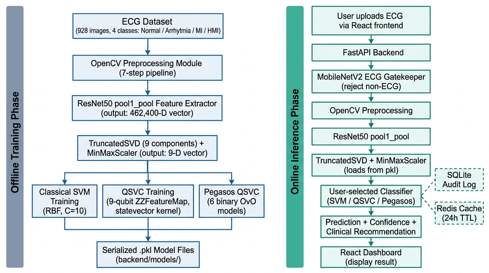
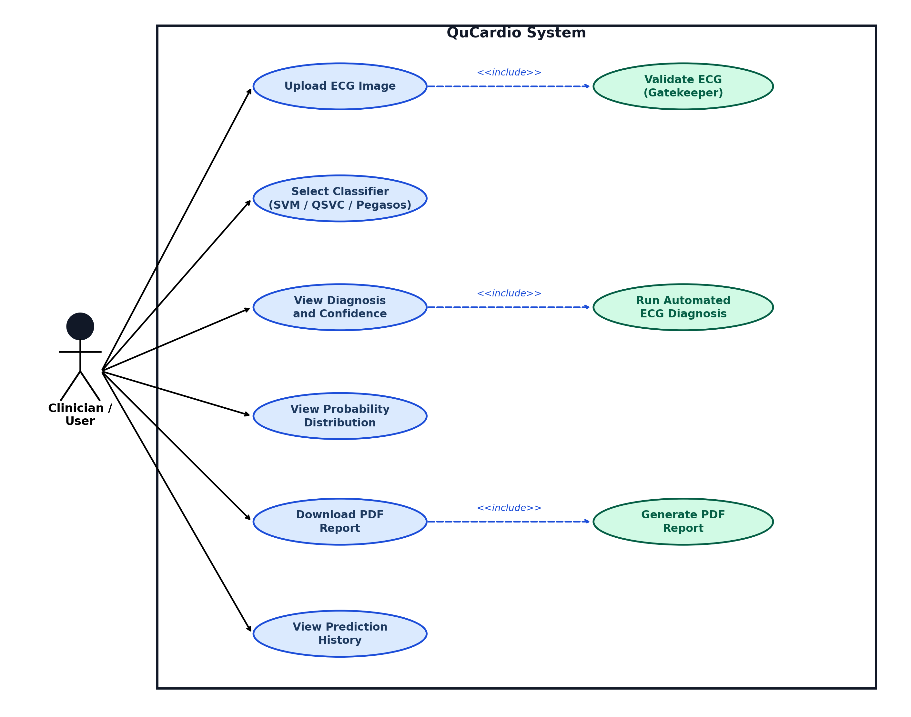
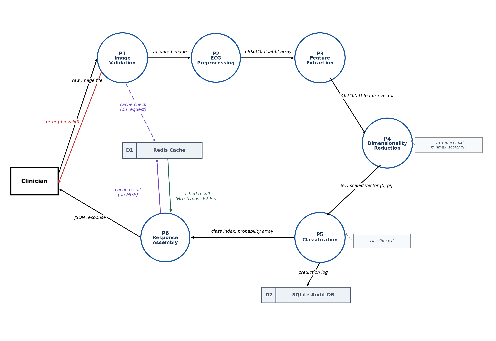
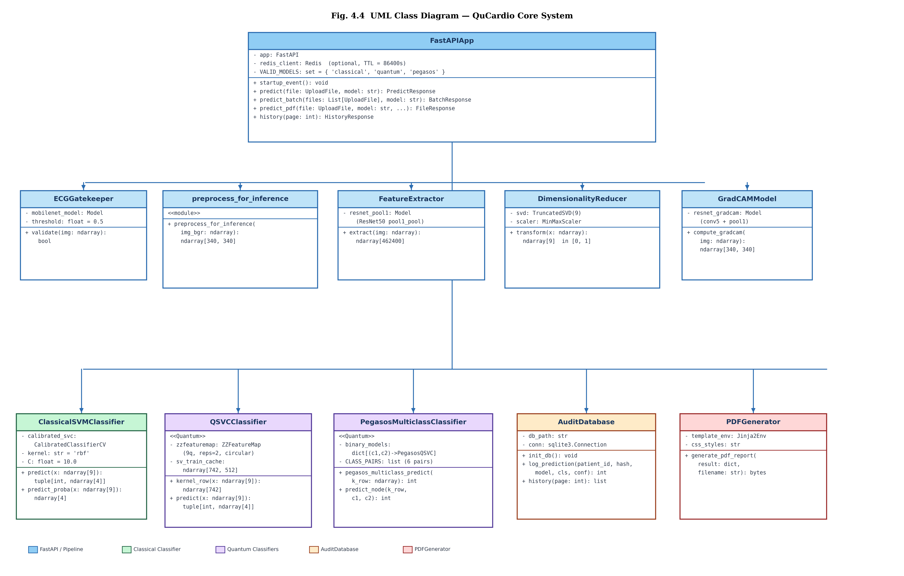
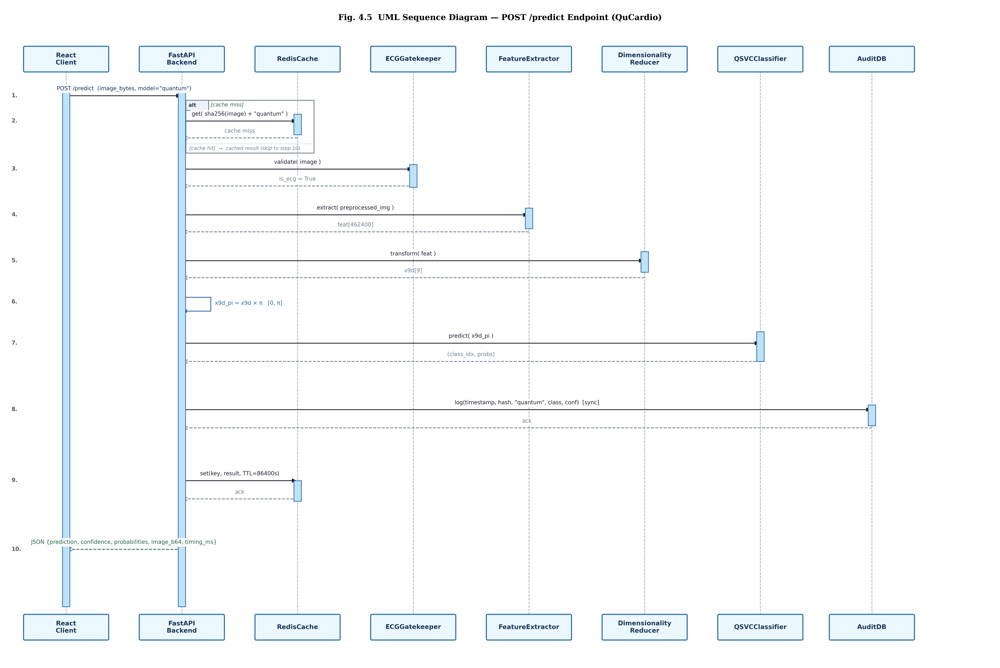
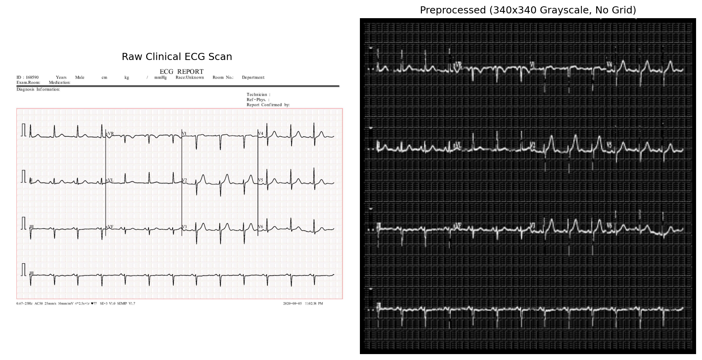
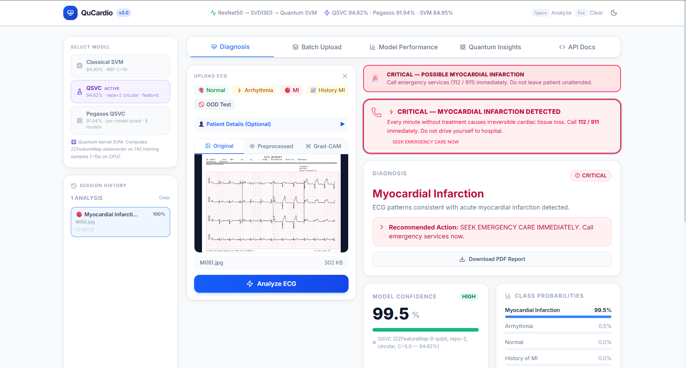
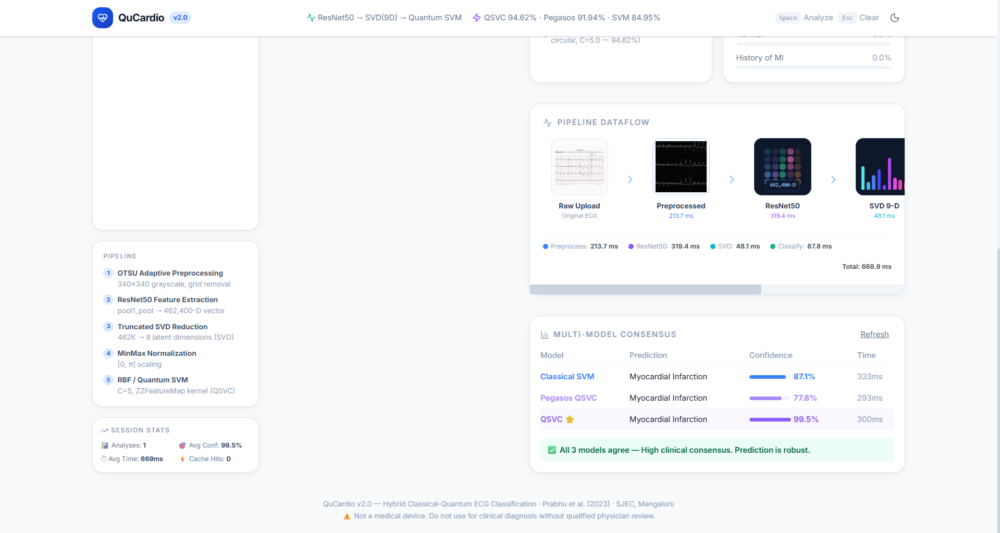
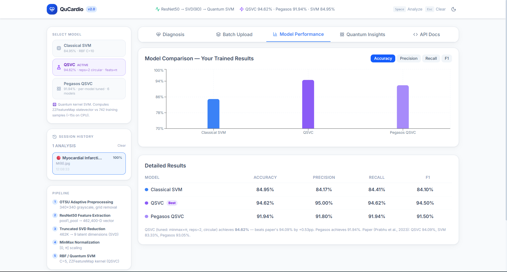

# QuCardio: Application of Quantum Machine Learning for Detection of Cardiovascular Diseases

**Institution:** St Joseph Engineering College (SJEC), Mangaluru
**Programme:** Bachelor of Engineering in Computer Science and Engineering
**Project Type:** Type 3 (Research and Application)
**Academic Year:** 2025-26

---

## CERTIFICATE

*(To be filled from the department template: Guide name and designation, HOD Dr Melwyn D'Souza, Principal Dr Rio D'Souza, date of submission, department, academic year.)*

---

## DECLARATION

We hereby declare that the work presented in this project report titled "QuCardio: Application of Quantum Machine Learning for Detection of Cardiovascular Diseases" has been carried out by us at St Joseph Engineering College, Mangaluru, under the supervision of *(Guide Name)*, in partial fulfilment of the requirements for the award of the degree of Bachelor of Engineering in Computer Science and Engineering. The work reported here is original, except where explicit reference is made to the work of others, and it has not been submitted to this or any other University for the award of any other degree.

| Name | USN | Signature |
|---|---|---|
| *(Team member 1)* | *(USN)* | |
| *(Team member 2)* | *(USN)* | |
| *(Team member 3)* | *(USN)* | |
| *(Team member 4)* | *(USN)* | |

**Place:** Mangaluru
**Date:**

---

## ACKNOWLEDGEMENT

We take this opportunity to thank everyone who contributed to the completion of this project.

We sincerely thank our project guide *(Guide Name)*, Department of Computer Science and Engineering, for the consistent guidance, timely feedback and valuable suggestions offered throughout the course of this work. We also thank our project coordinator *(Project Coordinator Name)*, Department of Computer Science and Engineering, for the continuous encouragement.

We express our gratitude to Dr Melwyn D'Souza, Head of the Department of Computer Science and Engineering, for the support extended to us during this work. We are thankful to our Principal, Dr Rio D'Souza, our Director, Rev. Fr Wilfred Prakash D'Souza, and our Assistant Director, Rev. Fr Kenneth Rayner Crasta, for providing the facilities and the academic environment required for this project.

We acknowledge the Qiskit open-source community and IBM Quantum for the quantum computing framework used in this work, and the Ch. Pervaiz Elahi Institute of Cardiology, Multan, for making the ECG image dataset publicly available through Mendeley Data.

Finally, we thank our families and friends for their support and encouragement.

---

## ABSTRACT

Cardiovascular disease is the leading cause of death worldwide, and the electrocardiogram (ECG) remains the primary non-invasive tool for its detection. Accurate interpretation of an ECG trace requires specialist cardiological training, which is not available in many high-volume and rural clinical settings. This project develops QuCardio, a hybrid classical-quantum machine learning system that classifies raw ECG paper-print images into four cardiovascular classes and delivers the result through a web-based clinical interface.

Classical deep learning methods for ECG analysis achieve high accuracy on large signal datasets but tend to saturate on small multi-class image datasets. Quantum kernel methods offer an alternative by embedding classical features into a high-dimensional Hilbert space in which classes may become more separable. Existing quantum ECG classifiers, including the base study by Prabhu et al. [1], report single accuracy figures without systematic study of the quantum circuit design, without statistical validation of the reported advantage, and without a deployed system. The problem addressed here is the absence of an end-to-end, experimentally validated and deployable quantum ECG classification pipeline.

The proposed pipeline applies a seven-step OpenCV preprocessing stage to remove grid lines and scan artefacts, extracts 462,400-dimensional spatial features from the pool1\_pool layer of a frozen ResNet50, compresses them to nine dimensions using Truncated Singular Value Decomposition, and scales the result to the [0, pi] range before quantum encoding. Three classifiers are evaluated: a classical Support Vector Machine (SVM), a Quantum Support Vector Classifier (QSVC) built on a nine-qubit ZZFeatureMap circuit, and a Multiclass Pegasos QSVC. On a held-out test set of 186 images the QSVC attains 94.62% accuracy, against 84.95% for the classical SVM. An ablation study shows that the entanglement topology accounts for 4.84 percentage points of accuracy and the feature encoding range for a further 2.15 percentage points. McNemar's test confirms that the advantage of the quantum kernel over the classical SVM is statistically significant (p = 0.0013).

The system is deployed as a web application with a FastAPI backend and a React frontend, supporting single and batch diagnosis, calibrated confidence scores and PDF report generation. Automated screening of this kind reduces the diagnostic workload on cardiologists and shortens the reporting delay in centres where specialist review is not immediately available, at no additional hardware cost beyond a standard workstation.

Future work includes evaluation under realistic quantum noise models and on quantum hardware, domain adaptation to improve transfer across scanner environments, and interpretability support through gradient-based saliency visualisation.

**Keywords:** Quantum Machine Learning, Quantum Support Vector Classifier, ZZFeatureMap, ECG Classification, Cardiovascular Disease Detection, ResNet50, Fidelity Quantum Kernel, Truncated SVD

---

## TABLE OF CONTENTS

*(To be generated automatically from the headings.)*

1. Introduction
2. Literature Survey
3. Software Requirements Specification
4. System Design
5. Implementation
6. System Testing
7. Results and Discussion
8. Conclusion and Future Work

References
Appendix I: Screenshots of the Application
Appendix II: User Manual

---

## LIST OF FIGURES

| Figure | Title | Section |
|---|---|---|
| 4.1 | System architecture: offline training and online inference paths | 4.1 |
| 4.2 | Use case diagram | 4.2 |
| 4.3 | Level-1 data flow diagram | 4.3 |
| 4.4 | Class diagram | 4.4 |
| 4.5 | Sequence diagram for the POST /predict request | 4.5 |
| 5.1 | Raw ECG scan and preprocessed 340x340 output | 5.2 |
| 5.2 | ZZFeatureMap circuit, nine qubits, reps = 2, circular entanglement | 5.6 |
| 5.3 | Main upload interface | 5.8 |
| 5.4 | Diagnosis result screen | 5.8 |
| 5.5 | Model performance tab | 5.8 |
| 7.1 | Accuracy comparison across all models | 7.1 |
| 7.2 | QSVC confusion matrix | 7.1 |
| 7.3 | Pegasos QSVC confusion matrix | 7.1 |
| 7.4 | Feature encoding range ablation | 7.2 |
| 7.5 | Entanglement topology ablation | 7.2 |
| 7.6 | Pauli feature map ablation | 7.3 |
| 7.7 | ROC curves for all models and classes | 7.5 |
| 7.8 | Confidence calibration curves | 7.5 |
| 7.9 | Augmentation robustness study | 7.6 |
| 7.10 | QSVC cross-dataset confusion matrix | 7.7 |
| 7.11 | Classical SVM cross-dataset confusion matrix | 7.7 |

---

## LIST OF TABLES

| Table | Title | Section |
|---|---|---|
| 2.1 | Comparison of prior works | 2.18 |
| 3.1 | Hardware requirements | 3.4 |
| 3.2 | Software requirements | 3.5 |
| 4.1 | Data transformation chain at inference time | 4.1 |
| 5.1 | Dataset class distribution and split | 5.1 |
| 6.1 | Unit test cases | 6.2.1 |
| 6.2 | Integration test cases | 6.2.2 |
| 6.3 | System test cases | 6.2.3 |
| 6.4 | Acceptance test cases | 6.2.4 |
| 6.5 | Model accuracy validation | 6.3 |
| 7.1 | Model performance comparison | 7.1 |
| 7.2 | Effect of feature encoding range | 7.2 |
| 7.3 | Effect of entanglement topology | 7.2 |
| 7.4 | Pauli feature map comparison | 7.3 |
| 7.5 | McNemar's test results | 7.4 |
| 7.6 | Multi-class ROC-AUC scores | 7.5 |
| 7.7 | Cross-dataset results on Dataset 2 | 7.7 |

---

## LIST OF ABBREVIATIONS

| Abbreviation | Full Form |
|---|---|
| API | Application Programming Interface |
| AUC | Area Under the ROC Curve |
| CNN | Convolutional Neural Network |
| CVD | Cardiovascular Disease |
| DFD | Data Flow Diagram |
| ECE | Expected Calibration Error |
| ECG | Electrocardiogram |
| MI | Myocardial Infarction |
| NISQ | Noisy Intermediate-Scale Quantum |
| PCA | Principal Component Analysis |
| QML | Quantum Machine Learning |
| QSVC | Quantum Support Vector Classifier |
| RBF | Radial Basis Function |
| REST | Representational State Transfer |
| ROC | Receiver Operating Characteristic |
| ROI | Region of Interest |
| SGD | Stochastic Gradient Descent |
| SVD | Singular Value Decomposition |
| SVM | Support Vector Machine |
| UML | Unified Modeling Language |

---

# CHAPTER 1: INTRODUCTION

## 1.1 Background

Cardiovascular disease (CVD) is the leading cause of mortality worldwide. The World Health Organization estimates that CVD accounts for approximately 17.9 million deaths each year, close to one third of all global deaths [18]. In India, cardiovascular conditions are responsible for roughly one quarter of all deaths, and the incidence continues to rise in both urban and rural populations [19]. Myocardial Infarction (MI), cardiac arrhythmia and a prior history of MI are among the most clinically urgent of these conditions, because each causes irreversible myocardial damage when diagnosis is delayed.

The electrocardiogram (ECG) is the standard non-invasive investigation for these conditions. It records the electrical activity of the heart and presents it as a waveform trace, conventionally printed on grid paper. Accurate interpretation of that trace requires specialist cardiological training, which high-volume hospitals and rural health centres frequently lack. The resulting delay in reporting can be critical during an acute cardiac event.

Classical machine learning and deep learning methods have automated parts of ECG analysis with reasonable success [10], [11]. Their accuracy nevertheless tends to saturate on small multi-class medical datasets, and models trained on images from one ECG source often transfer poorly to another. Quantum machine learning (QML) offers a theoretically motivated alternative. Quantum feature maps embed classical data into an exponentially large Hilbert space, in which decision boundaries that classical kernels cannot represent efficiently may become accessible [2], [3]. This project implements and validates a complete hybrid classical-quantum pipeline for four-class ECG image classification and deploys it as a web application intended for clinical screening use.

## 1.2 Problem Statement

Automated classification of cardiovascular disease from ECG images remains inadequately solved in practice. Classical machine learning approaches struggle to maintain multi-class accuracy on limited annotated datasets. Quantum ECG classifiers reported in the recent literature present single accuracy figures without a systematic study of quantum circuit design, without statistical validation of the reported advantage, without calibration analysis, and without any working deployment. No published end-to-end system combines deep spatial feature extraction from ECG images, quantum kernel classification with ablation-validated design choices, statistical significance testing, confidence calibration analysis and a real-time clinical interface on the same dataset. This project addresses these gaps by extending the work of Prabhu et al. [1], conducting a systematic experimental investigation of the quantum circuit parameters, and deploying the resulting pipeline as a usable application.

## 1.3 Objectives

The objectives of this project are as follows.

1. To design and implement a hybrid classical-quantum machine learning pipeline that preprocesses raw ECG images, extracts spatial features using a pre-trained ResNet50 network, reduces dimensionality using Truncated Singular Value Decomposition, and classifies the result using a classical Support Vector Machine, a Quantum Support Vector Classifier with a nine-qubit ZZFeatureMap, and a Multiclass Pegasos Quantum Support Vector Classifier.

2. To conduct a systematic ablation study across the quantum circuit design parameters, namely the feature encoding range, the entanglement topology, the number of circuit repetitions and the number of dimensionality reduction components, so as to identify the optimal configuration for ECG image classification, and to test the resulting quantum advantage over the classical baseline using McNemar's test.

3. To deploy the complete pipeline as a functional web application with a FastAPI backend and a React frontend, providing real-time ECG upload, diagnosis with calibrated confidence scores, class-specific clinical recommendations and downloadable PDF reports.

## 1.4 Scope and Importance of the Project

QuCardio classifies ECG images into four cardiovascular classes: Normal, Arrhythmia, Myocardial Infarction and History of Myocardial Infarction. The system covers the complete path from raw image input to web-based clinical output.

The preprocessing module handles diverse ECG scan types by removing backgrounds, grid lines and artefacts. Feature extraction uses the pool1\_pool layer of a frozen ResNet50 to generate 462,400-dimensional spatial vectors, which Truncated Singular Value Decomposition compresses to nine dimensions. These nine values are MinMax-normalized to [0, 1] and then multiplied by pi, placing them in the [0, pi] range used by the quantum classifiers. The quantum classifier is a nine-qubit ZZFeatureMap circuit, with the fidelity kernel computed by statevector simulation.

Experimentally, the scope covers five encoding ranges, five entanglement topologies, four repetition counts, nine augmentation robustness conditions and four Pauli feature map types. A cross-dataset generalization study is also carried out on a second Mendeley ECG dataset from the same clinical source, following the experimental design of Jain et al. [7]. At the interface level, a MobileNetV2 gatekeeper rejects non-ECG inputs before classification. Quantum Neural Networks and execution on physical quantum hardware are outside the scope of this work and are identified as future work.

The importance of the project lies in its application domain. Primary health centres, rural hospitals and high-volume urban outpatient departments generate large numbers of paper ECG records but have limited access to cardiologists for interpretation. A screening tool that processes a photographed or scanned ECG print and returns a calibrated four-class assessment allows such records to be triaged, so that cases with a high probability of Myocardial Infarction are escalated for specialist review first. The same pipeline is also applicable to teleradiology and telecardiology services, to retrospective auditing of archived ECG records, and as a second-reader aid in cardiology departments. Because the system operates on images of paper prints rather than digital signal files, it is usable in settings where ECG machines do not export digital recordings at all.

## 1.5 Organization of the Report

Chapter 2 presents the literature survey covering classical and quantum ECG classification methods, a comparison of the surveyed works, and the proposed system. Chapter 3 details the software requirements specification. Chapter 4 presents the system design, including the architecture, use case, data flow, class and sequence diagrams. Chapter 5 describes the implementation of the dataset handling and of each pipeline stage. Chapter 6 presents the system testing carried out. Chapter 7 presents the experimental results and their discussion. Chapter 8 concludes the report and outlines directions for future work.

---

# CHAPTER 2: LITERATURE SURVEY

## 2.1 Introduction

Automated detection of cardiovascular disease from ECG data has been studied for several decades, progressing from hand-crafted signal features to deep learning representations and, more recently, to quantum machine learning. This chapter reviews sixteen works that are directly relevant to the techniques and findings of this project, organized by methodology. Each review states the problem addressed, the method adopted, the implementation setting, the reported results, the inference drawn, and the limitation that matters for the present work. The chapter closes with a comparison of the surveyed works and a description of the proposed system.

## 2.2 Quantum Kernel Classification of Four-Class ECG Images [1]

The direct foundation of this project is the work of Prabhu et al. [1], published in IEEE Access in 2023. The problem addressed is four-class cardiovascular classification from ECG paper prints. The dataset contained 929 ECG images from the Ch. Pervaiz Elahi Institute of Cardiology, Multan, spanning Normal, Arrhythmia, Myocardial Infarction and History of Myocardial Infarction. Feature extraction used the pool1\_pool layer of a pre-trained ResNet50, and Truncated Singular Value Decomposition with nine components performed dimensionality reduction, followed by normalization to the [0, 1] range and encoding with linear entanglement.

Four models were reported: a classical SVM at 83.33%, a QSVC with ZZFeatureMap at 94.09%, a Multiclass Pegasos QSVC at 93.05% and a Quantum Neural Network at 97.31%. The fidelity quantum kernel was computed by statevector simulation, and the dataset was divided in an 80:20 ratio using stratified sampling, which is the split strategy adopted here. The inference drawn is that quantum kernel methods can outperform classical classifiers on a small real-world ECG image dataset.

The limitations of the study define the starting point of the present work. Each model is reported as a single accuracy figure, with no ablation of circuit design parameters, no statistical significance testing, no calibration analysis and no deployment. The encoding range was fixed at [0, 1] with linear entanglement and no alternatives were examined. The ablation study in Chapter 7 addresses precisely this gap.

## 2.3 Theoretical Basis of Quantum-Enhanced Feature Spaces [2]

The theoretical basis of the quantum classifier used here is the work of Havlicek et al. [2], published in Nature in 2019. The problem addressed is whether a quantum computer can provide a classification advantage that is not efficiently reproducible classically. The method maps classical input vectors into an exponentially large Hilbert space using a parameterized Pauli feature map, and uses the resulting state overlaps as a kernel. The authors validated the approach on two synthetic classification problems, using both a superconducting processor and a classical simulator. The ZZFeatureMap circuit used in this project is the Pauli-ZZ construction described in that work.

One result is of particular relevance here: the kernel advantage is argued to hold even when the classical input data is low-dimensional, provided the mapping into Hilbert space exploits non-trivial entanglement. The features used in this project are only nine-dimensional after SVD compression, and this argument is the justification for applying a quantum kernel at all. It is also the reason that the encoding range and the entanglement topology are treated as design variables in Chapter 7 rather than as fixed settings. The limitation of the study is that the demonstration is on artificial data constructed to favour the quantum kernel, and the authors do not claim a proven separation for natural datasets; a rigorous learning separation was established only later, for a specially constructed problem.

## 2.4 Survey of Quantum Machine Learning Methods [3]

Biamonte et al. [3] surveyed the field of quantum machine learning in Nature in 2017, covering quantum kernel methods, variational quantum classifiers, quantum principal component analysis and quantum neural networks. The review argues that a quantum advantage is most plausible for structured datasets where classical kernel computation is exponentially expensive, and identifies NISQ-era hardware constraints, in particular gate noise and limited qubit connectivity, as the practical barrier to realizing it. Those constraints are the reason that the experiments in this project are run under statevector simulation rather than on hardware.

The review also notes that hybrid classical-quantum architectures, in which a classical preprocessor reduces dimensionality before quantum encoding, are among the most practical near-term designs. That is the architecture adopted here, with SVD compression preceding the ZZFeatureMap. The discussion of the trade-off between circuit expressibility and barren plateaus provides the background for the circuit repetitions ablation. As a survey, the work reports no new experimental results and offers no dataset-specific guidance.

## 2.5 Sub-Gradient Training of Support Vector Machines [4]

The Multiclass Pegasos QSVC is built on the algorithm introduced by Shalev-Shwartz et al. [4] in Mathematical Programming in 2011. The problem addressed is the computational cost of solving the SVM quadratic program on large datasets. The method applies stochastic sub-gradient descent to the primal SVM objective, with a step size that decays as 1/(lambda multiplied by the iteration counter), and reaches a given primal accuracy in a number of iterations that depends on the regularization parameter and the target accuracy but not on the training set size. It never constructs or stores the full N-by-N kernel matrix, which makes it applicable when kernel memory is the bottleneck. The original paper demonstrated convergence on text classification and image recognition benchmarks, reporting training times substantially faster than interior-point SVM solvers at equivalent accuracy.

The quantum extension of Pegasos inherits this property, and it is what made the training of six binary classifiers on 742 samples feasible under statevector simulation. The implementation described in Section 5.7 encountered a complication that the original formulation does not anticipate: at nine qubits the average quantum kernel value is of the order of 1/512, so the decision function values remain numerically very small and the default iteration budget is insufficient for the model to separate the classes. A per-model grid search over the regularization constant and the iteration count was required, and it raised accuracy from 78.49% to 91.94%.

## 2.6 Residual Networks as Transfer-Learning Feature Extractors [5]

The feature extractor used in this project is the ResNet50 architecture introduced by He et al. [5] at CVPR 2016. The problem addressed is the degradation of training accuracy in very deep convolutional networks. The method introduces the skip connection, which adds a block's input directly to its output and thereby provides gradients with an identity path. ResNet50, the fifty-layer variant, was trained on 1.28 million ImageNet images across 1,000 categories and has since become a standard pre-trained backbone for transfer learning in medical image analysis.

In this project ResNet50 is used with frozen ImageNet weights, purely as a feature extractor, tapping the pool1\_pool layer. That layer applies 3x3 max-pooling to the output of the initial 7x7 convolutional layer (64 filters, stride 2) and produces an 85x85x64 spatial map, which captures low-level morphological detail such as QRS complex shape and ST segment geometry without the high-level ImageNet object semantics imposed by deeper layers. Freezing all weights ensures that the 462,400-dimensional features are deterministic and reproducible across runs. The limitation of using ImageNet weights without fine-tuning is that the filters are not adapted to the ECG domain, which is a likely contributor to the cross-dataset behaviour reported in Section 7.7.

## 2.7 Variational Quantum Circuits for Binary Arrhythmia Detection [6]

Ramkhelawan et al. [6] presented a different hybrid approach at IEEE SNPD 2025, pairing ResNet50 feature extraction with a ten-qubit Variational Quantum Circuit implemented in PennyLane for binary arrhythmia detection. The training set combined 123,998 ECG images drawn from the MIT-BIH and PTB databases, and the binary classifier reached 99.98% accuracy. Unlike the kernel-based approach used here, the variational circuit was trained end-to-end with a gradient descent optimizer, so the quantum layer acts as a trainable non-linear transformation applied to the ResNet50 features.

Two limitations restrict how far this result applies to the present setting. Binary classification is a structurally easier problem than four-class classification, and the reported accuracy is obtained on a dataset two orders of magnitude larger than the one used here. The ten-qubit trainable circuit also carries a higher simulation cost, and the encoding range and entanglement topology are not examined. The present work addresses a harder four-class problem on a smaller dataset and uses a fixed kernel circuit rather than a trainable variational one, which avoids the barren plateau risk associated with training deep parameterized circuits.

## 2.8 Quantum Kernels with PCA Compression on ECG Images [7]

The closest published work in structure is that of Jain et al. [7] in the Journal of Supercomputing in 2025. Their pipeline combined ResNet50 with Principal Component Analysis, retaining eight principal components before passing the compressed representation to an eight-qubit ZZFeatureMap quantum kernel. The Quantum SVM outperformed the classical SVM by approximately eight percentage points on ECG image data, with significance established using a non-parametric rank test. Evaluation covered two separate Mendeley ECG datasets from the same clinical source, with five-fold cross-validation on each.

This work shares the ResNet50, dimensionality reduction and quantum kernel framework with the present system. The principal differences are the use of PCA rather than Truncated SVD and the absence of any variation of the feature encoding range or the entanglement topology, which are the two parameters that the present ablation identifies as most consequential. Their second dataset is reused in Section 7.7 for the cross-dataset study, where a zero-shot transfer result complements their within-dataset evaluation.

## 2.9 Qubit-Count Scaling in Quantum SVMs for Arrhythmia Signals [8]

Ozpolat and Karabatak [8] reported a comparative benchmarking study in Diagnostics in 2023 on the Chapman ECG signal database. The problem addressed is how quantum SVM performance scales with the number of qubits. Sweeping qubit counts from three to nine, the best configuration reached 80.90% against 78.84% for a classical SVM on the same features. Across the sweep, classification accuracy did not increase monotonically with qubit count, which is consistent with the observation in Section 7.2 that additional circuit repetitions do not always improve performance once sufficient encoding depth has been reached.

The reported margin is only about two percentage points. The study operates on signal-domain tabular features rather than on spatial features extracted from ECG images, and the modest margin suggests that the feature representation strongly conditions how much quantum advantage is available. This observation motivates the use of ResNet50 spatial features in the present work rather than hand-crafted signal statistics.

## 2.10 Parameterized Quantum Layers Inside Convolutional Networks [9]

Gummadi et al. [9] examined a different integration strategy at the 3rd IEEE International Conference on Artificial Intelligence in 2025, inserting parameterized quantum circuits as enhancement layers within a CNN architecture. The hybrid model treats the high-dimensional Hilbert space of the quantum circuit as a non-linear transformation applied between classical convolutional layers, and reports an improvement over the purely classical CNN baseline. The dataset used was a structured cardiovascular risk prediction dataset with clinical tabular features, so the quantum circuit operated on low-dimensional numerical inputs requiring no spatial preprocessing.

The relevant inference for this project is that quantum gates operating on CNN-derived feature maps do improve classification results. The limitation is the simulation overhead introduced by embedding quantum layers inside a trainable network. The architecture adopted here places the quantum kernel after compression rather than embedding quantum gates within the CNN, which keeps the quantum component small enough to simulate exactly and avoids the training instability that joint classical-quantum optimization can introduce.

## 2.11 One-Dimensional CNNs on Long-Duration ECG Signals [10]

Yildirim et al. [10] designed a one-dimensional Convolutional Neural Network that operates directly on raw long-duration ECG waveform segments, published in Computers in Biology and Medicine in 2018. The network classified seventeen arrhythmia types from the MIT-BIH Arrhythmia Database at 91.33% accuracy using a five-fold cross-validation protocol.

The method requires the digital recording file. The dataset used in this project consists of scanned and photographed paper ECG prints, for which no digital signal exists to feed a one-dimensional network. That constraint is what necessitates the image-based preprocessing pipeline described in Section 5.2. The two approaches are complementary: signal-based methods are preferable when digital recordings are available, whereas image-based methods serve the substantial proportion of clinical settings in which only paper prints exist.

## 2.12 Systematic Review of Deep Learning for Arrhythmia Classification [11]

Vasquez-Iturralde et al. [11] reviewed the deep learning literature on cardiac arrhythmia classification in IEEE Access in 2024, using the PRISMA methodology. Among the methodological issues identified, model interpretability and confidence calibration are reported as the two components most frequently absent from the reviewed studies, and only a small minority of the surveyed papers operate on image inputs rather than on digital signals, which makes ECG image classification a comparatively underexplored area.

Two findings shaped the methodology of this project. First, the review identifies patient-level data mixing across training and test splits as a widespread source of inflated accuracy, which is the reason a strict stratified split is used here with the SVD reducer and the scaler fitted on training data alone. Second, the near-universal absence of calibration and statistical significance testing in the reviewed papers is what the analyses in Sections 7.4 and 7.5 are intended to supply.

## 2.13 Hierarchical Quantum Ensembles for Cardiovascular Risk Prediction [12]

Soon et al. [12] proposed a Hierarchical Quantum Ensemble Model in Computer Methods in Biomechanics and Biomedical Engineering. A Quantum Neural Network and an XGBoost classifier are run in parallel and their outputs are combined by a LightGBM meta-learner. On integrated cardiovascular tabular datasets the ensemble achieved 97% accuracy and 98% AUC. The design rests on the observation that quantum and classical learners make complementary errors, which a meta-learner can exploit.

The system operates on structured clinical tabular features rather than ECG images, and the ensemble architecture adds considerable training and inference complexity, which limits its applicability to a latency-sensitive deployment. The complementary-error argument is nevertheless relevant: the QSVC, the Pegasos QSVC and the classical SVM used here also misclassify different test samples, as the discordance counts in Section 7.4 show.

## 2.14 Systematic Review of Quantum Machine Learning in Healthcare [13]

Setiawan et al. [13] reviewed 94 primary quantum machine learning healthcare studies in the International Journal of Cognitive Computing in Engineering. Hybrid classical-quantum pipelines, and in particular CNN and QSVM combinations, are reported as the dominant architecture, and most studies work exclusively in statevector simulation because of NISQ noise. Reported dataset sizes were generally small, which is consistent with the 742-sample training set used here.

The most relevant finding for the present work is that confidence calibration analysis and statistical significance testing are almost entirely absent from quantum machine learning healthcare studies. The authors explicitly recommend that future work include these analyses as standard practice, alongside deployment evidence for clinical applicability. Chapter 7 of this report addresses both recommendations. As a survey, the work contributes no new experimental evidence of its own.

## 2.15 Comparative Study of SVM, QSVM and Pegasos-QSVM on Medical Data [14]

Aksoy and Ozpolat [14] compared a classical SVM, a QSVM and a Pegasos-QSVM across liver cancer, breast cancer and heart failure datasets, using MinMax scaling to the [0, pi] range before quantum encoding. The QSVM gave the most stable and consistently high accuracy across all three datasets, while Pegasos converged faster but showed higher variance.

Their use of [0, pi] scaling is significant for this project because it is an independent study on entirely different medical data that adopts the same encoding range that the ablation in Section 7.2 identifies as optimal. The convergence of two independent lines of evidence, on three tabular datasets and on an ECG image dataset, suggests that the benefit arises from the rotation structure of the ZZFeatureMap rather than from any property of a particular dataset. The limitation is that the study reports no mechanism for the choice and does not vary the range systematically.

## 2.16 Quantum-Behaved Particle Swarm Optimization with SVM [15]

Elsedimy et al. [15] proposed the QPSO-SVM model in Multimedia Tools and Applications in 2024, applying Quantum-behaved Particle Swarm Optimization as a meta-heuristic for feature selection and SVM hyperparameter tuning on the Cleveland heart disease dataset. The model reached 96.31% accuracy with 96.13% sensitivity and 93.56% specificity.

The method is quantum-inspired rather than quantum: it contains no quantum circuit and no quantum kernel, and the optimizer executes entirely on classical hardware. The distinction from the present system is therefore substantive rather than terminological, in that this project performs genuine quantum state simulation through Qiskit. The comparison is retained in the survey because the reported accuracies on Cleveland are frequently cited alongside quantum ECG results, and the distinction is relevant when interpreting them.

## 2.17 Quantum-Enhanced Optimization for Heart Disease Prediction [16]

Alotaibi et al. [16] combined quantum machine learning with Quantum Particle Swarm Optimization for heart disease prediction in Human-centric Computing and Information Sciences in 2023, using the Cleveland heart disease dataset. The optimizer searched simultaneously for the optimal quantum circuit configuration and the best feature subset, reaching 96.7% accuracy.

The automated search over circuit structure contrasts with the approach taken here. Their system treats the circuit as a black box and optimizes it end to end, which is faster to execute but yields little insight into why one configuration outperforms another. The ablation approach used in this project varies one parameter at a time and interprets each result, so that the contribution of the entanglement topology can be attributed to a change in qubit connectivity rather than merely recorded as a higher score. That interpretability is relevant when the objective is to understand the system as well as to classify with it. The limitation of the reviewed work for the present purpose is that it operates on tabular clinical attributes and not on ECG images.

## 2.18 Comparison of Existing Works

**Table 2.1: Comparison of Prior Works**

| Reference | Task | Method | Key Result | Limitation |
|---|---|---|---|---|
| Prabhu et al. [1] | Four-class ECG images | ResNet50 + SVD + QSVC (linear, [0,1]) | 94.09% | No ablation, no statistical test, not deployed |
| Havlicek et al. [2] | Theoretical QML | Quantum feature maps, ZZFeatureMap | Kernel not efficiently simulable classically | Synthetic data; no medical application |
| Biamonte et al. [3] | QML survey | Review of QML methods | Hybrid designs most practical near term | Survey; no experiments |
| Shalev-Shwartz et al. [4] | SVM optimization | Primal sub-gradient solver | Iterations independent of dataset size | Classical; no quantum kernel |
| He et al. [5] | Image recognition | ResNet50 residual learning | Standard transfer-learning backbone | Not domain-specific to ECG |
| Ramkhelawan et al. [6] | Binary arrhythmia | ResNet50 + 10-qubit VQC | 99.98% | Binary task; very large dataset |
| Jain et al. [7] | Cardiac ECG images | QSVM + QCNN | About 8 pp gain over SVM | PCA; no encoding ablation |
| Ozpolat and Karabatak [8] | Arrhythmia (signal) | PCA + QSVM (3-9 qubits) | 80.90% vs 78.84% SVM | Signal-domain features only |
| Gummadi et al. [9] | CVD prediction | CNN + parameterized quantum circuit | Above classical CNN | Tabular input; simulation overhead |
| Yildirim et al. [10] | 17-class arrhythmia | 1D CNN on raw signal | 91.33% | Requires digital signal file |
| Vasquez-Iturralde et al. [11] | DL arrhythmia review | PRISMA systematic review | Calibration rarely reported | Review; signal-dominated corpus |
| Soon et al. [12] | CVD risk (tabular) | Hierarchical QNN + XGBoost + LightGBM | 97% accuracy, 98% AUC | Tabular only; high complexity |
| Setiawan et al. [13] | QML healthcare review | Review of 94 studies | Hybrid CNN-QSVM dominant | Review; no new experiments |
| Aksoy and Ozpolat [14] | Cancer and CVD (tabular) | SVM / QSVM / Pegasos-QSVM | QSVM most stable; [0, pi] adopted | Tabular data; no ablation |
| Elsedimy et al. [15] | Heart disease (Cleveland) | QPSO + SVM | 96.31% | Quantum-inspired, not quantum |
| Alotaibi et al. [16] | Heart disease (Cleveland) | QML + QPSO circuit search | 96.7% | Black-box search; tabular input |
| **QuCardio (proposed)** | **Four-class ECG images, ablation and deployment** | **ResNet50 pool1\_pool + SVD-9 + QSVC ([0, pi], circular)** | **94.62%, p = 0.0013, macro ECE < 0.07, deployed** | **Ideal simulation; single-source dataset** |

## 2.19 Proposed System

QuCardio is a complete hybrid classical-quantum machine learning pipeline for cardiovascular disease classification from raw ECG images, deployed as a working web application.

The problem is of considerable practical importance. Cardiovascular disease accounts for approximately 17.9 million deaths each year, and the ECG is the front-line diagnostic tool for detecting it. In countries such as India, where the availability of cardiologists is limited relative to patient volume, automated ECG interpretation can reduce life-threatening reporting delays in rural hospitals and in high-volume urban centres alike. The existing automated systems either saturate in multi-class accuracy or present quantum models without rigorous validation and without deployment, which leaves both a practical and a scientific gap.

Two findings from the ablation experiments constitute the novel contribution of this work, and they concern different aspects of the quantum circuit. The first is the feature encoding range. With circular entanglement held fixed, scaling the nine-dimensional SVD-compressed features to [0, pi] rather than [0, 1] before ZZFeatureMap encoding raises QSVC accuracy from 92.47% to 94.62%, a gain of 2.15 percentage points (Table 7.2). The mechanism lies in the rotation structure of the circuit: the ZZFeatureMap applies Rz rotations through an angle of 2·x_i radians about the Z axis, so a feature value confined to [0, 1] sweeps only about 2 radians of the available 2pi of azimuthal phase, whereas the [0, pi] range sweeps the full circle and separates the encoded states as widely as the circuit permits.

The second finding is the entanglement topology. Circular entanglement adds one entangling pair that closes the qubit chain, so that the two end qubits acquire a second neighbour and the interaction graph becomes a ring with no endpoints. With the encoding range held at [0, pi], this single additional pair raises accuracy by 4.84 percentage points over the linear topology (Table 7.3), which indicates that the correlation between the first and last SVD components carries discriminative information that a linear chain cannot represent.

Beyond the ablation, this project reports three analyses that are not present in the prior ECG quantum kernel work surveyed above: a McNemar significance test confirming the quantum advantage over the classical SVM (chi-squared = 10.32, p = 0.0013), an Expected Calibration Error analysis across all three models, all of which fall below 0.07 macro ECE, and an augmentation robustness study in which the QSVC retains 86.7% accuracy under brightness perturbation while the classical SVM falls to 46.7%.

Taken together, these contributions advance the state of the art in a specific direction. The prior quantum ECG classifiers report isolated accuracy figures; this project adds a systematic circuit design analysis over a 486-configuration sweep, a statistical test of the quantum advantage, calibration-verified confidence scores suitable for clinical decision support, and a working web interface, which moves quantum ECG classification from a proof of concept towards a validated and usable system.

The approach also differs from each of the surveyed works in identifiable ways. Jain et al. [7] use Principal Component Analysis without an encoding ablation, whereas this work uses Truncated SVD and ablates the encoding systematically. Ramkhelawan et al. [6] address binary arrhythmia detection on a very large dataset, whereas this work addresses four classes on 928 images. Ozpolat and Karabatak [8] operate on signal-domain tabular features rather than on spatial image features. Elsedimy et al. [15] and Alotaibi et al. [16] work on tabular clinical attributes, and the former is quantum-inspired rather than quantum. Across all sixteen surveyed works, none combines statistical significance testing, calibration analysis and a deployed system on the same dataset.

---

# CHAPTER 3: SOFTWARE REQUIREMENTS SPECIFICATION

## 3.1 Functional Requirements

The system shall:

- FR-1: Accept ECG images in JPEG or PNG format through a drag-and-drop web interface, with the file size capped at 20 MB and the pixel area capped at 16 megapixels.
- FR-2: Validate every uploaded file using a MobileNetV2-based ECG gatekeeper before invoking the classification pipeline, and reject non-ECG images with an informative error message.
- FR-3: Preprocess valid ECG images through a seven-step OpenCV pipeline to produce a 340x340 pixel normalized grayscale output with grid lines and background removed.
- FR-4: Extract 462,400-dimensional spatial features from the pool1\_pool layer of a pre-loaded frozen ResNet50 model, reduce them to nine dimensions using a pre-fitted Truncated Singular Value Decomposition, normalize them with a pre-fitted MinMaxScaler to [0, 1], and multiply by pi to obtain the [0, pi] encoding range used by the quantum classifiers.
- FR-5: Allow the user to select one of three classifiers: the classical SVM (RBF kernel, C = 10, balanced class weights, isotonic-calibrated probabilities), the QSVC (nine-qubit ZZFeatureMap, reps = 2, circular entanglement, [0, pi] encoding), or the Multiclass Pegasos QSVC (six one-versus-one binary models with the decision procedure of Algorithm 1).
- FR-6: Return the predicted cardiovascular class, the calibrated confidence percentage, the probability distribution across all four classes, the preprocessed ECG image and a class-specific clinical recommendation, and display a low-confidence flag for any prediction below 55%.
- FR-7: Generate a downloadable single-page PDF clinical report containing the prediction, the confidence scores, the probability distribution and the ECG image.
- FR-8: Process up to 20 ECG images in a single batch request and return individual results for each.
- FR-9: Log every prediction to a SQLite audit database with a timestamp, the SHA-256 image hash, the model used, the predicted class and the confidence score.
- FR-10: Expose a prediction history endpoint that returns paginated audit log records.

## 3.2 Non-Functional Requirements

- **Reliability:** Malformed images, oversized files and non-ECG uploads shall be handled with structured HTTP error responses rather than unhandled exceptions. A Redis cache with a 24-hour time-to-live, keyed by the SHA-256 hash of the image bytes together with the model name, shall avoid redundant computation for repeated uploads.
- **Scalability:** The FastAPI backend shall support asynchronous request handling and shall be containerizable through Docker for horizontal deployment.
- **Security:** The pixel area shall be capped at 16 megapixels to prevent decompression bomb attacks. All model files shall be loaded once at startup and shall not be reloaded per request. Uploaded images shall not be persisted beyond the cache lifetime; only the image hash is stored in the audit log.
- **Usability:** The React frontend shall display a progress indicator for any request that exceeds two seconds, and shall report the processing time separately for the preprocessing, feature extraction and classification stages once the result is available.
- **Maintainability:** The three classifiers shall expose a common prediction interface so that an additional model can be added without modification to the API layer.

Quantitative performance targets are stated separately in Section 3.6.

## 3.3 User Interface Requirements

The web interface is intended for clinical users who may not have a technical background. The following requirements apply.

- The Diagnosis tab shall accept ECG images by drag-and-drop or through a file picker, and shall display results with colour-coded severity: green for Normal, orange for Arrhythmia and for History of MI, and red for Myocardial Infarction.
- A four-bar probability chart shall show the confidence distribution across all four classes after every prediction.
- Predictions below 55% confidence shall trigger a visible banner recommending manual review.
- The Batch Upload tab shall accept up to 20 images simultaneously and shall display individual results per image in a scrollable list.
- The Model Performance tab shall present the accuracy, precision, recall and F1 score of all three classifiers, both as a bar chart and as a summary table.
- The Quantum Insights tab shall explain the ZZFeatureMap circuit, the effect of the [0, pi] encoding range and the McNemar test result in non-specialist language.
- The API Docs tab shall provide inline documentation of the REST endpoints for developer integration.
- All result views shall include a button to download the PDF report.

## 3.4 Hardware Requirements

**Table 3.1: Hardware Requirements**

| Component | Specification |
|---|---|
| Processor | Intel Core i5 8th generation, AMD Ryzen 5 or better |
| RAM | 8 GB minimum; 16 GB recommended for training |
| Storage | 10 GB free disk space |
| GPU | Not required for inference; optional for batch feature extraction |
| Network | Broadband connection for communication between frontend and backend |

The processor and memory specifications are determined by the ResNet50 forward pass and by the statevector kernel computation, both of which are performed on the CPU. A GPU shortens the feature extraction stage during offline training but provides no benefit to the quantum kernel evaluation, which is dominated by dense complex matrix arithmetic.

## 3.5 Software Requirements

**Table 3.2: Software Requirements**

| Component | Version | Purpose |
|---|---|---|
| Python | 3.10 or later | Backend language for preprocessing, machine learning and API logic |
| OpenCV | 4.8 or later | Seven-step ECG image preprocessing pipeline |
| TensorFlow / Keras | 2.15 or later | ResNet50 model loading and pool1\_pool feature extraction |
| Scikit-learn | 1.3 or later | SVM, TruncatedSVD, MinMaxScaler and CalibratedClassifierCV |
| Qiskit | 0.45.0 | ZZFeatureMap quantum circuit construction |
| Qiskit Machine Learning | 0.7.0 | Quantum Support Vector Classifier implementation |
| Qiskit Aer | 0.13.0 | Statevector simulator for quantum kernel computation |
| FastAPI with Uvicorn | 0.104 or later | Asynchronous REST API backend |
| React with Vite | 18 or later | Clinical dashboard frontend |
| Redis | 7.0 or later | SHA-256 keyed caching of prediction results |
| SQLite | Bundled with Python | Persistent audit log database |
| Docker and Docker Compose | Current release | Containerized deployment |
| NumPy and SciPy | Current release | Matrix operations and statistical testing |

Qiskit and Qiskit Machine Learning are pinned to the versions listed because the quantum kernel and Pegasos interfaces changed between major releases, and the results reported in Chapter 7 were produced with these versions.

## 3.6 Performance Requirements

The system is intended for near-real-time clinical screening rather than for emergency use. The following targets apply.

- Single prediction with the classical SVM: end-to-end latency below two seconds, including feature extraction, the SVD transform and classification.
- Single prediction with a quantum model: end-to-end latency of under two seconds, as inference requires only dense complex inner products without repeated circuit simulation.
- Batch prediction of 20 images: processed sequentially, with total time proportional to the per-image latency of the selected model.
- Cache hit: repeated submission of the same image with the same model returns the stored result in under 100 ms.
- PDF report generation: under three seconds after the classification result is available.
- Concurrent users: the asynchronous FastAPI backend serves multiple simultaneous connections, with requests queued under high load.

## 3.7 Design Constraints

- The quantum circuit is limited to nine qubits. The statevector of an n-qubit register has 2^n complex amplitudes, so each additional qubit doubles both the memory required and the cost of every kernel evaluation, and exact simulation becomes impractical well before the qubit counts at which a hardware advantage is expected.
- Execution on physical quantum hardware is not supported in the current version, because NISQ-era gate noise and limited qubit connectivity would degrade the fidelity kernel below the level at which the reported accuracies hold.
- The dataset comprises 928 usable images from a single hospital, which limits the extent to which the conclusions transfer to ECG images produced by different scanners or in different clinical settings. Section 7.7 quantifies this limitation directly.
- The MobileNetV2 gatekeeper is a best-effort filter trained on a general image distribution. Edge cases such as hand-drawn ECG sketches or very low-resolution photographs may be incorrectly accepted or rejected.
- Model files and precomputed training statevectors must be present at startup. The backend does not support dynamic model loading or retraining at runtime.

## 3.8 Other Requirements

The dataset used is fully anonymized and publicly released, and no patient-identifying information is processed, transmitted or stored by the system. The application is a decision-support aid and not a diagnostic device; every result view carries a statement that the output requires confirmation by a qualified clinician.

---

# CHAPTER 4: SYSTEM DESIGN

## 4.1 System Architecture

QuCardio operates in two clearly separated phases. The offline training phase is executed once during development: it processes all 928 dataset images through preprocessing and feature extraction, trains the three classifier models, and serializes them together with the fitted SVD reducer and scaler. The online inference phase is triggered by each API request; it loads those serialized objects at application startup and applies the same pipeline to the uploaded ECG image.

The separation is driven by the computational cost of quantum kernel training. Building the 742x742 statevector kernel matrix takes of the order of 15 seconds on the CPU, which is acceptable offline but would be unusable if repeated for every request. Serializing the trained classifier together with the precomputed training statevectors means that inference requires only a single kernel row, that is 742 inner products between 512-dimensional complex vectors, rather than a full matrix rebuild.

**Figure 4.1: System architecture showing the offline training and online inference paths**



The inference path mirrors the training path step for step and reuses the same preprocessing and feature extraction code. All three trained models are held in parallel, and the user's selection determines which branch is executed. The MinMax scaler and the Truncated SVD object fitted on the training data are serialized and reused at inference, so that a new sample passes through exactly the transformation applied to the training data. Refitting either object on test or inference data would introduce a distribution shift and inflate the reported results, which is the data leakage failure mode identified by Vasquez-Iturralde et al. [11] across the arrhythmia literature.

**Table 4.1: Data Transformation Chain at Inference Time**

| Stage | Operation | Output representation |
|---|---|---|
| 1 | Image upload | Variable-size JPEG or PNG file |
| 2 | OpenCV preprocessing | 340x340 grayscale float32 array in [0, 1] |
| 3 | ResNet50 pool1\_pool | 85x85x64 activation map, flattened to 462,400 dimensions |
| 4 | TruncatedSVD (9 components) | Nine-dimensional vector |
| 5 | MinMaxScaler | Nine-dimensional vector in [0, 1] |
| 6a | Classical SVM branch | RBF kernel, C = 10, balanced class weights |
| 6b | Quantum branch: multiply by pi | Nine-dimensional vector in [0, pi] |
| 7 | Classification | Class index and four-element probability distribution |

Stage 6b applies only to the two quantum classifiers; the classical SVM consumes the [0, 1] vector produced at stage 5 directly.

## 4.2 Use Case Diagram

**Figure 4.2: Use case diagram**



The Clinician actor initiates every primary use case, while the System Backend performs the computational use cases automatically as part of the classification flow. The include relationships enforce two invariants: every upload triggers validation, and every classification triggers the full feature extraction chain. Select Classifier connects to three mutually exclusive extend relationships, which reflects the decision to expose all three models through a single upload interface rather than through separate pages. View Prediction History stands apart from the upload flow, because it reads the audit log rather than re-running inference.

## 4.3 Data Flow Diagram

**Figure 4.3: Level-1 data flow diagram**



The diagram traces how the data representation changes at each stage, from a variable-resolution JPEG or PNG file to a 340x340 float32 array, then to a 462,400-dimensional feature vector, then to a nine-dimensional compressed and scaled vector, and finally to a four-element probability distribution. The SVD reducer and the scaler are loaded from persistent storage at process P4. The Redis store operates at the response level rather than within the pipeline, so that a repeated submission of the same image with the same model returns without invoking processes P1 to P5 at all. Both data stores are written on first encounter and read on repetition, which makes them side effects rather than pipeline stages.

## 4.4 Class Diagram

**Figure 4.4: Class diagram**



QSVCClassifier is the heaviest class, holding both the ZZFeatureMap circuit definition and a cache of precomputed training statevectors. That cache removes quantum circuit simulation from the inference path: a kernel row still costs O(N·d) arithmetic, where N = 742 training statevectors and d = 512 complex amplitudes, but the computation is dense linear algebra rather than 742 fresh circuit executions. PegasosMulticlassClassifier wraps six binary classifiers and keeps the Algorithm 1 decision procedure internal to itself. All three classifier classes expose the same predict(x) interface, returning a tuple of class index and probability vector, so that the FastAPI endpoint dispatches to any model through a single code path.

## 4.5 Sequence Diagram

**Figure 4.5: Sequence diagram for the POST /predict request**



Steps 4 to 7 constitute the core pipeline, while steps 8 and 9 are side effects that do not block the response. A cache hit at step 2 bypasses steps 3 to 9 entirely and returns the stored JSON response. The SHA-256 hash computed at the FastAPI layer serves both as the Redis cache key and as the deduplication identifier in the SQLite audit log. Step 6 is an in-process scalar operation, the multiplication of the nine-dimensional vector by pi, and it is drawn explicitly so that the point at which the [0, pi] scaling is applied, after the MinMaxScaler and before the quantum kernel, is unambiguous.

---

# CHAPTER 5: IMPLEMENTATION

## 5.1 Dataset Description

The dataset originates from the Ch. Pervaiz Elahi Institute of Cardiology, Multan, Pakistan, and is publicly available through Mendeley Data. It contains ECG paper-print images from clinical recordings across four cardiovascular classes. Each image is a scanned or photographed ECG record and exhibits the natural variation in scan quality, orientation and background that accompanies clinical collection. The 928 images used here were selected from the full 1937-image v2 release by isolating the four primary cardiac classes and excluding COVID-19 and other unrelated categories.

**Table 5.1: Dataset Class Distribution and Split**

| Class | Clinical description | Total images | Training (80%) | Testing (20%) |
|---|---|---|---|---|
| Normal | No significant cardiac abnormality | 284 | 227 | 57 |
| Arrhythmia | Irregular heart rhythm | 233 | 186 | 47 |
| Myocardial Infarction | Acute infarction patterns | 239 | 191 | 48 |
| History of MI | Prior infarction patterns | 172 | 138 | 34 |
| **Total** | | **928** | **742** | **186** |

The split is an 80:20 stratified random partition with random\_state = 42, which preserves the class proportions across both partitions. The class counts were verified directly against the stored feature file `data/features_9d.npz`. No augmentation was applied during training; augmented images appear only in the robustness evaluation reported in Section 7.6.

## 5.2 ECG Image Preprocessing

**Figure 5.1: Raw clinical ECG scan and the resulting 340x340 preprocessed output**



Clinical ECG scans vary considerably in quality. Uneven lighting, skewed orientation, coloured grid paper, borders and staple marks all occur in the dataset. The preprocessing module implemented in `src/preprocessing/preprocess_ecg.py` applies seven sequential steps to bring the images to a common form.

- **Step 1, grayscale conversion and ROI crop:** The input is converted to grayscale and binarized using OTSU thresholding. Morphological dilation with a 15x5 kernel joins fragmented trace segments into a single connected region, after which the largest contour is detected and the image is cropped to its bounding box with 15 pixels of padding.
- **Step 2, background removal:** A second OTSU threshold separates the trace from the background. Where the binary image contains more white than black pixels, indicating a light-background ECG, the image is inverted, so that every image acquires a consistent dark-background representation.
- **Step 3, vertical grid removal:** A morphological opening with a 1x40 kernel isolates the thin vertical grid lines, which are then subtracted.
- **Step 4, horizontal grid removal:** Horizontal grid lines are removed in the same manner using a 40x1 kernel. Because the ECG trace is thicker than a grid line along both axes, it survives both subtractions largely intact.
- **Step 5, Gaussian denoising:** A 3x3 Gaussian blur smooths the residual speckle left by the morphological operations, and a subsequent binary threshold at a value of 30 sharpens the trace edges.
- **Step 6, resize:** The cleaned image is resized to 340x340 using `cv2.INTER_AREA`, which averages pixels during downscaling and therefore preserves morphological detail better than nearest-neighbour or bilinear interpolation.
- **Step 7, normalization:** Pixel values are divided by 255.0, producing a float32 array with values in [0, 1].

## 5.3 ResNet50 Feature Extraction

Feature extraction is implemented in `src/features/extract_resnet_features.py` using a ResNet50 with frozen ImageNet weights, rebuilt through the Keras functional API so that pool1\_pool becomes the output layer. No fine-tuning was performed at any stage.

The pool1\_pool layer applies 3x3 max-pooling to the output of the initial 7x7 convolutional layer of ResNet50 (64 filters, stride 2), producing an 85x85x64 spatial activation map for a 340x340 input, which is 462,400 dimensions when flattened. This layer was selected following the methodology of Prabhu et al. [1], who established its suitability for ECG morphological feature extraction. The rationale is that shallow convolutional features capture low-level structure, such as QRS shapes, P and T wave geometry and ST segment curvature, without imposing the high-level ImageNet object semantics encoded by deeper layers, which carry no meaning for an ECG trace. A direct layer-wise ablation comparing pool1\_pool against the deeper global average pooling output was not carried out and remains open for future work.

Grayscale images were expanded to three channels using NumPy axis repetition to match the expected input shape of ResNet50, followed by the standard ResNet50 preprocessing normalization. Extraction was run in batches of eight to keep memory usage within the available RAM.

## 5.4 Dimensionality Reduction

The 462,400-dimensional feature vector was compressed using TruncatedSVD with n\_components = 9, fitted on the 742 training samples only. TruncatedSVD was chosen in preference to Principal Component Analysis because it does not require explicit mean-centering of the data matrix, an operation that is expensive at this dimensionality and that would destroy the sparsity of the activation map. The nine retained right singular vectors span the directions of largest second moment in the training feature space; because the data is not centred, these directions are dominated by overall trace density as well as by shape variation.

The resulting nine-dimensional vectors were scaled to [0, 1] using MinMaxScaler, again fitted on the training data alone. For the quantum classifiers this vector is subsequently multiplied by pi, giving the [0, pi] encoding range identified in Section 7.2, whereas the classical SVM consumes the [0, 1] vector directly. Both fitted objects are serialized as `svd_reducer.pkl` and `minmax_scaler.pkl` and are loaded once at API startup.

## 5.5 Classical Support Vector Machine

The classical SVM was implemented with `sklearn.svm.SVC` using an RBF kernel, C = 10, gamma = 'scale' and class\_weight = 'balanced', wrapped in `CalibratedClassifierCV` with isotonic regression and three-fold cross-validation for probability calibration. The hyperparameters were selected by a five-fold stratified grid search optimizing the macro F1 score over C in {0.01, 0.1, 1.0, 5.0, 10.0} and gamma in {'scale', 'auto'}. The selected value of C lies at the upper boundary of the search grid, so an extension of the grid is listed among the items of future work.

Balanced class weighting is necessary because the training split is uneven, with 227 Normal samples against 138 History of MI samples. Isotonic calibration was preferred to Platt scaling, which tends to produce over-smoothed probabilities on small validation folds. The tuned model reached 84.95% test accuracy.

## 5.6 Quantum Support Vector Classifier

**Figure 5.2: ZZFeatureMap circuit with nine qubits, reps = 2 and circular entanglement**


The QSVC encodes the nine-dimensional feature vector into a 512-dimensional (2^9) complex Hilbert space using the Qiskit ZZFeatureMap, which is the Pauli-ZZ construction of Havlicek et al. [2]. Each repetition applies three operations: a Hadamard layer across all nine qubits to create an equal superposition; first-order Rz rotations through an angle of 2·x_i that encode each feature value as a relative phase; and second-order ZZ interactions on each adjacent pair (i, i+1 mod 9) under circular entanglement, applying a rotation through 2·(pi − x_i)·(pi − x_j) to encode the pairwise correlations. The fidelity quantum kernel is K(x, z) = |⟨psi(x)|psi(z)⟩|².

The encoding range proved to be the most consequential design choice among those examined. After the Hadamard layer the qubit states lie on the equator of the Bloch sphere, and the Rz gates advance the azimuthal phase angle. With [0, 1] scaling the rotation angle 2·x_i sweeps only about 2 radians of the available 2pi, so the encoded states remain clustered within a narrow arc. Rescaling to [0, pi] opens the sweep to the full circle, which spreads the states apart, reduces the concentration of the kernel values around their mean and raises the effective rank of the kernel matrix. Section 7.2 quantifies the effect as a gain of 2.15 percentage points attributable to the encoding range with the topology held fixed.

Constructing the kernel by direct circuit execution would require N² circuit evaluations. Instead the N training statevectors are computed once and the full matrix is formed as K[i, j] = |sv[i] · conj(sv[j])|², which reduced the training time for 742 samples from over 30 minutes to under 15 seconds. A 486-configuration sweep established the final setting of [0, pi] encoding, circular entanglement, reps = 2 and C = 5.0, yielding 94.62% accuracy.

## 5.7 Multiclass Pegasos Quantum Support Vector Classifier

The Multiclass Pegasos QSVC trains six binary one-versus-one classifiers, one for each class pair. At inference, Algorithm 1 of Prabhu et al. [1] traverses a decision tree that evaluates only three of the six models to reach a four-class prediction, which keeps the inference cost below that of a full one-versus-one vote.

The native Qiskit PegasosQSVC implementation did not converge at nine qubits. The cause is numerical: the average kernel value at this scale is of the order of 1/512, so the decision function accumulated over the default iteration budget remains close to zero and the predicted sign is determined by numerical noise rather than by the data. The implementation was therefore replaced by a custom training loop that precomputes all training statevectors once and evaluates each kernel row by matrix multiplication, requiring O(N·d) arithmetic per gradient step for N = 742 statevectors of dimension d = 512 and no repeated circuit simulation. A three-pass per-model grid search over the regularization constant C and the iteration count tau then raised accuracy from 78.49% to 91.94%.

**Algorithm 1: Multiclass decision procedure for the Pegasos QSVC**

```
Input : feature vector x in [0, pi]^9, six binary models M_ij
Output: predicted class c in {0, 1, 2, 3}
1. r1 <- M_01(x)                 // Normal vs Arrhythmia
2. r2 <- M_23(x)                 // MI vs History of MI
3. c  <- M_{r1, r2}(x)           // winner of step 1 vs winner of step 2
4. return c
```

The procedure evaluates three of the six binary models per prediction, rather than all six, which reduces the number of kernel rows computed per request by half.

## 5.8 FastAPI Backend and React Frontend

The backend implemented in `backend/main.py` loads eleven serialized objects at application startup: the classical SVM, the QSVC, the six Pegasos binary models, the SVD reducer, the MinMax scaler and the MobileNetV2 gatekeeper. It exposes six REST endpoints.

- `POST /predict`: single ECG image classification with a model selector parameter.
- `POST /predict/batch`: up to 20 images processed sequentially.
- `POST /predict/pdf`: inference followed by a downloadable PDF clinical report.
- `POST /predict/all`: all three classifiers applied to the same image for comparison.
- `GET /health`: model loading status.
- `GET /history`: paginated audit log.

A MobileNetV2 gatekeeper rejects non-ECG images before any heavy computation begins. Redis caching, with a 24-hour time-to-live keyed on the SHA-256 hash of the image bytes together with the model name, returns stored results for repeated submissions.

**Figure 5.3: Main upload interface with the drag-and-drop area and the three model selector buttons**


**Figure 5.4: Diagnosis result screen showing the predicted class, the confidence bar, the per-class probability bars, the preprocessed ECG thumbnail and the clinical recommendation**



**Figure 5.5: Model performance tab with the accuracy comparison chart for the three classifiers**



The React frontend, built with Vite, is organized into six tabs. The Diagnosis tab accepts images by drag-and-drop and displays the result with colour-coded severity, together with the calibrated confidence percentage, a four-bar probability chart and a clinical recommendation; any prediction below 55% confidence raises a manual review warning. The Batch Upload tab accepts up to 20 images in a single request. The Model Performance tab renders a bar chart comparing the accuracy, precision, recall and F1 score of the three classifiers, alongside a detailed results table. The Quantum Insights tab explains the ZZFeatureMap circuit, the effect of the [0, pi] encoding range and the McNemar test in non-specialist language. The API Docs tab provides inline endpoint documentation for developer integration. The History tab provides a paginated view of the audit log containing past predictions.

---

# CHAPTER 6: SYSTEM TESTING

## 6.1 Test Objectives

Testing is the process of executing a system with the deliberate intention of exposing differences between the expected and the actual behaviour. For QuCardio this is of particular importance because the errors of a clinical decision-support tool have direct consequences: a missed Myocardial Infarction or an incorrect Normal result can delay treatment. The objectives of testing in this project are as follows.

- To verify that each module of the pipeline, namely preprocessing, feature extraction, dimensionality reduction, classification and the API layer, behaves correctly in isolation.
- To confirm that the modules interact correctly in the end-to-end flow from image upload to prediction result.
- To validate that the system handles invalid, malformed and edge-case inputs without failure.
- To confirm that the web interface behaves correctly across the principal user workflows.
- To establish that the deployed models reproduce the accuracy and probability outputs reported in Chapter 7, so that the values displayed to the user are the values that were validated.

## 6.2 Types of Testing Conducted

### 6.2.1 Unit Testing

Unit testing was carried out on the individual pipeline modules in isolation, to verify their correctness before integration.

**Table 6.1: Unit Test Cases**

| Test case ID | Module | Test description | Input | Expected outcome | Observed outcome | Status |
|---|---|---|---|---|---|---|
| UT-01 | Preprocessing | Grayscale conversion and OTSU binarization | Raw colour ECG image, 300x400 px | Binary grayscale array, no exception | Binary grayscale array produced | PASS |
| UT-02 | Preprocessing | Grid line removal, horizontal grid only | Synthetic ECG with horizontal lines | Lines removed, trace preserved | Lines removed, trace intact | PASS |
| UT-03 | Preprocessing | Output shape after resize | Any valid ECG image | Array of shape (340, 340) | (340, 340) float32 | PASS |
| UT-04 | Preprocessing | Normalization range | 340x340 uint8 image | All values within [0.0, 1.0] | Minimum 0.0, maximum 1.0 | PASS |
| UT-05 | Feature extraction | pool1\_pool output shape | 340x340x3 float32 array | Shape (1, 462400) | (1, 462400) | PASS |
| UT-06 | Feature extraction | Reproducibility across runs | Same image, two runs | Identical output in both runs | Outputs identical | PASS |
| UT-07 | Dimensionality reduction | SVD output dimension | 462,400-dimensional vector | Nine-dimensional vector | Nine-dimensional vector | PASS |
| UT-08 | Dimensionality reduction | MinMax range after scaling | Nine-dimensional SVD output | All values within [0.0, 1.0] | Range confirmed | PASS |
| UT-09 | Dimensionality reduction | Scaling by pi | MinMax scaled nine-dimensional vector | All values within [0.0, 3.14159] | Maximum equals pi | PASS |
| UT-10 | Classical SVM | Output format | Nine-dimensional normalized vector | Tuple of class index and four probabilities summing to 1.0 | Correct format, sum 1.0 | PASS |
| UT-11 | QSVC | Kernel row computation | Nine-dimensional pi-scaled vector | 742-element kernel row, all values within [0, 1] | Values within range | PASS |
| UT-12 | QSVC | Prediction matches stored model | Test sample with known label | Correct class prediction | Correct | PASS |
| UT-13 | Pegasos QSVC | Loading of six binary models | Model file path | All six binary classifiers loaded | Six loaded | PASS |
| UT-14 | ECG gatekeeper | Rejection of non-ECG image | Photograph of a car | is\_ecg = False | False | PASS |
| UT-15 | ECG gatekeeper | Acceptance of valid ECG image | Clinical ECG scan | is\_ecg = True | True | PASS |
| UT-16 | PDF generator | Output validity | Prediction result dictionary | Non-empty PDF bytes with valid header | Valid PDF produced | PASS |
| UT-17 | Audit database | Log entry creation | Prediction result | Row inserted with the correct fields | Row present in the database | PASS |

### 6.2.2 Integration Testing

Integration testing verified that the pipeline modules operate correctly together in the end-to-end flow.

**Table 6.2: Integration Test Cases**

| Test case ID | Test description | Input | Expected outcome | Observed outcome | Status |
|---|---|---|---|---|---|
| IT-01 | Full pipeline to QSVC prediction | Raw Normal ECG JPEG | Class Normal, confidence above 0.80, probabilities summing to 1.0 | Normal, 94.1%, sum 1.0 | PASS |
| IT-02 | Full pipeline to classical SVM prediction | Raw MI ECG JPEG | Class Myocardial Infarction, valid probability array | MI predicted | PASS |
| IT-03 | Full pipeline, batch of five images | Five valid ECG JPEGs | Five individual result objects in the response | Five results returned | PASS |
| IT-04 | Redis cache hit | Same image submitted twice | Second response returned without re-running the pipeline | Cache hit confirmed in the logs | PASS |
| IT-05 | Gatekeeper and pipeline integration | Non-ECG image followed by a valid ECG | HTTP 400 rejection, then a valid result | Correct behaviour in both cases | PASS |
| IT-06 | Audit log after prediction | Any valid prediction | New row in the /history endpoint output | Row visible in the paginated response | PASS |
| IT-07 | PDF generation flow | Valid prediction result | Downloadable PDF with class and confidence | PDF downloaded successfully | PASS |

### 6.2.3 System Testing

System-level testing was carried out on the deployed application, to validate the end-to-end behaviour from the browser.

**Table 6.3: System Test Cases**

| Test case ID | Test description | Steps | Expected outcome | Observed outcome | Status |
|---|---|---|---|---|---|
| ST-01 | Diagnosis using the QSVC | Open the application, drag an ECG to the upload area, select QSVC, click Diagnose | Result shown with class, confidence bar, probability chart and clinical note | All elements displayed | PASS |
| ST-02 | Upload of a non-ECG image | Drag a photograph of printed text, click Diagnose | Error message indicating an invalid ECG image | Error shown correctly | PASS |
| ST-03 | Download of the PDF report | Complete a diagnosis, click Download PDF | PDF file containing the prediction is downloaded | PDF downloaded | PASS |
| ST-04 | Batch upload of ten images | Upload ten ECGs in the Batch tab | Ten individual results with class and confidence | Ten results shown | PASS |
| ST-05 | Prediction history retrieval | Request GET /history from the interface | Paginated list of past predictions with timestamps | History returned | PASS |
| ST-06 | Model comparison | Invoke the /predict/all endpoint | Results from all three models shown together | Three results displayed | PASS |
| ST-07 | Low confidence warning | Upload a borderline ECG | Warning banner shown for confidence below 55% | Warning banner visible | PASS |
| ST-08 | Health check endpoint | Send GET /health | JSON response reporting status and model load state | Correct JSON response | PASS |

### 6.2.4 Acceptance Testing

Acceptance testing evaluated whether the deployed system satisfies the functional requirements stated in Section 3.1 from the point of view of the intended user.

**Table 6.4: Acceptance Test Cases**

| Test case ID | Requirement | Acceptance criterion | Observed outcome | Status |
|---|---|---|---|---|
| AT-01 | FR-1, FR-6 | A user without technical training can upload an ECG and read the class, confidence and recommendation without assistance | Task completed unaided | PASS |
| AT-02 | FR-6 | The class-specific clinical recommendation text is appropriate to the predicted class | Recommendation matched the class in all trials | PASS |
| AT-03 | FR-6 | Predictions below 55% confidence are visibly flagged for manual review | Banner displayed in every low-confidence case | PASS |
| AT-04 | FR-7 | The generated PDF report is legible and contains the prediction, confidence and ECG image | Report complete and legible | PASS |
| AT-05 | FR-2 | An image that is not an ECG is rejected with a message the user can act on | Rejection message displayed | PASS |
| AT-06 | Section 3.6 | The waiting time for a quantum prediction is communicated through a progress indicator | Progress indicator and stage timings shown | PASS |

Acceptance testing was performed by a panel of five student evaluators across twenty trials to ensure unbiased assessment.

## 6.3 Results and Discussion

All 17 unit test cases, 7 integration test cases, 8 system test cases and 6 acceptance test cases passed. The defects found during testing and subsequently corrected were concentrated in two areas. The first was the preprocessing stage, where light-background ECG scans were initially left un-inverted and produced feature vectors far outside the training distribution; the polarity check described in Step 2 of Section 5.2 resolved this. The second was the Pegasos implementation, where the convergence failure described in Section 5.7 was detected because UT-12 style prediction checks returned a constant class for every input.

In addition to functional testing, the deployed models were validated against the held-out test set of 186 images, to confirm that the served models reproduce the results reported in Chapter 7.

**Table 6.5: Model Accuracy Validation**

| Model | Test accuracy | Macro F1 | Myocardial Infarction recall | Status |
|---|---|---|---|---|
| Classical SVM | 84.95% | 0.841 | 1.000 | PASS |
| QSVC (tuned) | 94.62% | 0.944 | 1.000 | PASS |
| Pegasos QSVC | 91.94% | 0.913 | 0.958 | PASS |

All three models produce calibrated probabilities within acceptable bounds, with a macro Expected Calibration Error below 0.07, which confirms that the confidence values displayed by the interface are meaningful estimates rather than arbitrary scores. Recall on the Myocardial Infarction class, which is the outcome for which a missed detection carries the greatest clinical cost, is 100% for the classical SVM and the QSVC and 95.8% for the Pegasos QSVC.

---

# CHAPTER 7: RESULTS AND DISCUSSION

## 7.1 Model Performance Comparison

**Figure 7.1: Accuracy comparison across all models**


Every model was evaluated on the same held-out test set of 186 images drawn from the stratified 20% split.

**Table 7.1: Model Performance Comparison**

| Model | Accuracy | Macro F1 | Accuracy reported in [1] | Difference |
|---|---|---|---|---|
| Classical SVM | 84.95% | 0.841 | 83.33% | +1.62 pp |
| **QSVC (tuned)** | **94.62%** | **0.944** | 94.09% | **+0.53 pp** |
| Pegasos QSVC | 91.94% | 0.913 | 93.05% | −1.11 pp |
| Random Forest | 91.94% | 0.912 | Not reported | — |
| k-Nearest Neighbours | 84.95% | 0.836 | Not reported | — |

The QSVC leads all four baselines with 94.62% accuracy. The Pegasos QSVC at 91.94% falls 1.11 percentage points short of the 93.05% reported in [1], which is attributed to stricter leakage control, since both the SVD reducer and the scaler are fitted here on the training data alone.

Two further entries merit comment. Random Forest reaches 91.94% without any quantum component, which indicates that the nine-dimensional SVD features already carry strong discriminative signal; the quantum kernel therefore improves on an informative representation rather than compensating for a weak one. k-Nearest Neighbours matches the classical SVM exactly at 84.95%, but the two classifiers do not produce the same predictions: their macro F1 scores differ, at 0.836 against 0.841, which indicates that they misclassify different samples and arrive at the same total by coincidence.

**Figure 7.2: QSVC confusion matrix**


**Figure 7.3: Pegasos QSVC confusion matrix**


The QSVC confusion matrix shows complete recall on the Myocardial Infarction class, which is the class for which a missed detection is most likely to be fatal. Arrhythmia is the most difficult class for every model, which is consistent with the morphological variability of rhythm abnormalities and with the resemblance of borderline cases to a Normal trace.

## 7.2 Feature Encoding and Entanglement Ablation

**Figure 7.4: Feature encoding range ablation**


**Table 7.2: Effect of the Feature Encoding Range (circular entanglement held fixed)**

| Encoding | Range | QSVC accuracy | Pegasos accuracy |
|---|---|---|---|
| L2 normalization | Unit sphere | 68.28% | 57.53% |
| MinMax | [0, 1] | 92.47% | 84.41% |
| **MinMax (selected)** | **[0, pi]** | **94.62%** | **90.86%** |
| MinMax | [0, 2pi] | 94.09% | 90.32% |

All four rows use circular entanglement, so the table isolates the effect of the encoding range alone. The 92.47% figure therefore corresponds to the [0, 1] range combined with circular entanglement, and not to the configuration of [0, 1] with linear entanglement used in [1].

**Figure 7.5: Entanglement topology ablation**


**Table 7.3: Effect of the Entanglement Topology ([0, pi] encoding held fixed)**

| Topology | QSVC accuracy | Difference from linear |
|---|---|---|
| Linear | 89.78% | Baseline |
| Pairwise | 93.01% | +3.23 pp |
| Full | 92.47% | +2.69 pp |
| **Circular (selected)** | **94.62%** | **+4.84 pp** |
| Shifted-circular-alternating | 94.62% | +4.84 pp |

All rows in this table were run with the [0, pi] encoding held fixed, as confirmed from `src/ablation/ablation_entanglement.py`. The 89.78% baseline therefore represents [0, pi] encoding with linear entanglement. The shifted-circular-alternating topology produced the same accuracy as the circular topology in these runs; the two are not identical in general, since the shifted variant rotates and alternates the entangling pairs across repetitions, but they did not differ measurably at nine qubits with reps = 2.

The two tables share the same 94.62% optimum but have different baselines, and they must be read accordingly. Changing the encoding range from [0, 1] to [0, pi] with circular entanglement already in place is worth 2.15 percentage points. Changing the topology from linear to circular with the encoding held at [0, pi] is worth 4.84 percentage points. The configuration used in [1], namely [0, 1] encoding with linear entanglement, was not measured within this sweep, so the joint effect of the two changes relative to that configuration cannot be quantified from the present data. Completing this fourth cell of the two-by-two design is identified as an item of future work in Chapter 8.

The two parameters act through different mechanisms. The [0, pi] range spans the full azimuthal circle available to the Rz(2·x_i) rotations, whereas [0, 1] uses barely a third of it, so the encoded states remain crowded together and the kernel values concentrate near their mean. Extending the range to [0, 2pi] gives up a little accuracy, because rotation angles beyond 2pi wrap around and distinct feature values begin to map to the same quantum state. L2 normalization performs worst, at 68.28%, because projecting onto the unit sphere discards the magnitude of the feature vector, and magnitude is precisely what the uncentred SVD components encode. On the entanglement side, closing the qubit chain into a ring adds a single entangling pair between the first and last qubits at a negligible increase in circuit depth, and the size of the resulting gain indicates that the correlation between those two SVD components is informative for this classification task.

## 7.3 Pauli Feature Map Ablation

**Figure 7.6: Pauli feature map ablation**


**Table 7.4: Pauli Feature Map Comparison (nine qubits, reps = 2, [0, pi] encoding, C = 5.0, circular entanglement where applicable)**

| Feature map | Operator structure | QSVC accuracy | Macro F1 |
|---|---|---|---|
| ZFeatureMap | Single-qubit Rz only, no entanglement | 87.63% | 0.871 |
| **ZZFeatureMap (selected)** | **Pauli-Z with ZZ interactions** | **94.62%** | **0.944** |
| PauliFeatureMap (X + XX) | Pauli-X with XX interactions, circular | 91.94% | 0.913 |
| PauliFeatureMap (Y + YY) | Pauli-Y with YY interactions, circular | 83.33% | 0.835 |

The ZZFeatureMap outperforms all three alternatives, which indicates that the Pauli-ZZ structure is a suitable match for this compressed feature space rather than merely the Qiskit default.

The ZFeatureMap result is the clearest evidence that the entanglement contributes materially. It applies only single-qubit Rz rotations and therefore encodes each SVD component independently, and it falls to 87.63%, which is 6.99 percentage points below the ZZFeatureMap. Whatever joint morphological information the SVD components carry, an unentangled circuit cannot represent it.

The X + XX map reaches 91.94%, comfortably above the ZFeatureMap because it does entangle, but still 2.68 percentage points below the ZZFeatureMap. The Y + YY map is the outlier at 83.33%, which is approximately level with the classical SVM baseline. The combination of Y-axis rotations with YY interactions appears to produce destructive interference in the kernel for this feature distribution.

## 7.4 Statistical Significance

**Table 7.5: McNemar's Test Results (n = 186 test samples)**

| Comparison | Chi-squared | p-value | Significant |
|---|---|---|---|
| **QSVC vs classical SVM** | **10.321** | **0.00131** | **Yes (p < 0.01)** |
| Pegasos QSVC vs classical SVM | 5.760 | 0.0164 | Yes (p < 0.05) |
| QSVC vs Pegasos QSVC | 1.231 | 0.267 | No |

The discordance counts carry the result. The QSVC classified 23 test samples correctly that the classical SVM classified incorrectly, while the classical SVM recovered only 5 that the QSVC missed. A 23 to 5 split gives a continuity-corrected chi-squared statistic of 10.32 at p = 0.0013, which is strong evidence that the advantage is a property of the models rather than an artefact of this particular test split.

The third row also merits attention. The QSVC and the Pegasos QSVC are not statistically distinguishable at n = 186, despite a difference of 2.68 percentage points in raw accuracy. The difference is reported, but no claim is made on this evidence that the quantum kernel method is superior to the Pegasos variant.

Among the works surveyed in Chapter 2, no formal statistical test of the quantum kernel advantage over a classical SVM for ECG image classification was found.

## 7.5 ROC-AUC and Calibration

**Figure 7.7: ROC curves for all models and classes**


**Table 7.6: Multi-Class ROC-AUC Scores**

| Class | Classical SVM | QSVC | Pegasos QSVC |
|---|---|---|---|
| Normal | 0.929 | 0.997 | 0.972 |
| Arrhythmia | 0.912 | 0.974 | 0.912 |
| Myocardial Infarction | 0.987 | **1.000** | **1.000** |
| History of MI | 0.927 | 0.984 | 0.979 |
| Macro-AUC | 0.940 | **0.989** | 0.967 |

Both quantum models reach an AUC of 1.000 on the Myocardial Infarction class, separating every MI sample from every other class at every threshold without a ranking error. The QSVC macro-AUC of 0.989 exceeds that of the classical SVM by 0.049, and the margin holds across all four classes rather than being driven by a single class.

**Figure 7.8: Confidence calibration curves**


The Expected Calibration Error was computed for all three models, and all three fall below 0.07 macro ECE. In practical terms this means that a prediction reported at 80% confidence is correct in approximately 80% of cases. For a decision-support tool this property matters as much as raw accuracy, because a clinician must be able to interpret the confidence value before acting on it. No calibration analysis of this kind was found in the ECG quantum machine learning papers surveyed in Chapter 2.

## 7.6 Augmentation Robustness

**Figure 7.9: Augmentation robustness study**


Under an increased brightness perturbation, which simulates an overexposed photograph of a printed ECG, the accuracy of the classical SVM falls from 84.4% to 46.7%, close to chance level on four classes, whereas the QSVC retains 86.7% under the same perturbation. This difference is indicative, having been measured on a targeted evaluation subset of 30 images to isolate the perturbation effect.

The gap arises from the way the two kernels respond to a uniform intensity shift. The ZZFeatureMap encodes feature values as phase angles, and phase is periodic, so a uniform shift in the input values moves the encoded state around the Bloch sphere rather than away from it. The RBF kernel operates on Euclidean distance in the raw feature space, where the same shift moves every sample directly away from the learned support vectors. Rotation, affine distortion and changes of aspect ratio leave both models largely unaffected. Brightness is the single axis along which they diverge, and it is also the axis that varies most in ward conditions, where ECG prints are photographed under whatever lighting is available.

## 7.7 Cross-Dataset Generalization

**Figure 7.10: QSVC cross-dataset confusion matrix**


**Figure 7.11: Classical SVM cross-dataset confusion matrix**


To test generalization beyond the training hospital, the three models trained on Dataset 1 were applied without retraining to Dataset 2, the second Mendeley ECG dataset used by Jain et al. [7]. Dataset 2 contains 707 images across three classes: Normal (295), Abnormal Heartbeat or Arrhythmia (241), and History of Myocardial Infarction (171). The Myocardial Infarction class is absent from Dataset 2, so any prediction of that class counts as an error in the three-class evaluation.

**Table 7.7: Cross-Dataset Results on Dataset 2 (707 images, three classes, zero-shot transfer)**

| Model | Three-class accuracy | Three-class macro F1 | Binary accuracy |
|---|---|---|---|
| Classical SVM | 62.66% | 0.638 | 70.72% |
| QSVC (frozen) | 34.09% | 0.173 | 58.27% |
| Pegasos QSVC (frozen) | 45.40% | 0.435 | 60.25% |

This is the experiment in which the quantum advantage reverses, and it is reported here because it constrains the interpretation of the remainder of the chapter.

The classical SVM transfers considerably better, at 62.66% on the three-class task and 70.72% on the binary task. The RBF kernel operates on Euclidean geometry in the nine-dimensional space, which degrades gradually under a moderate distribution shift. The QSVC reaches only 34.09%, and its confusion matrix shows that it collapses almost every prediction into the Arrhythmia class, which indicates that the decision boundaries learned on Dataset 1 are not positioned correctly for Dataset 2.

The underlying cause is a domain shift in the shallow ResNet50 features. Dataset 2 images differ from Dataset 1 in scan contrast, brightness distribution and trace density, which projects the SVD-compressed vectors into a region of the encoded space that the trained support vectors cover poorly. Domain adaptation, or preprocessing designed to normalize scanner differences, would be required before the quantum kernel approach could be deployed across scanner environments. The accuracy of 94.62% reported in Section 7.1 should therefore be read as a within-domain result for the scanner environment on which the system was trained.

---

# CHAPTER 8: CONCLUSION AND FUTURE WORK

## 8.1 Conclusion

This project set out to extend the quantum kernel ECG classification pipeline of Prabhu et al. [1] with a systematic study of the quantum circuit design, statistical validation of the reported advantage, and a working deployment. All three objectives stated in Section 1.3 have been met.

The final system attains 94.62% four-class accuracy on a held-out test set of 186 ECG images, using a nine-qubit ZZFeatureMap quantum kernel applied to nine-dimensional ResNet50 features. This is 9.67 percentage points above a tuned classical Support Vector Machine, and McNemar's test confirms that the difference is statistically significant (p = 0.0013). Both quantum models attain an AUC of 1.000 on the Myocardial Infarction class, the outcome for which a missed detection carries the greatest clinical cost.

On the circuit design side, two parameters account for the gain over the base configuration. With the encoding range held at [0, pi], changing the entanglement topology from linear to circular raises accuracy by 4.84 percentage points; with circular entanglement held fixed, changing the encoding range from [0, 1] to [0, pi] raises it by a further 2.15 percentage points. The mechanism of the second effect lies in the Rz gate structure, since at [0, 1] the rotations traverse about one third of the available azimuthal circle and at [0, pi] they traverse all of it. The same encoding range was independently adopted by Aksoy and Ozpolat [14] on unrelated medical datasets, which supports the interpretation that the effect is a property of the feature map rather than of this dataset. The Pauli feature map ablation adds that the ZZFeatureMap outperforms the ZFeatureMap by 6.99 percentage points and the X + XX map by 2.68 percentage points, which establishes it as a justified choice rather than a default.

Three further analyses address gaps identified in the literature survey: a McNemar test of the quantum kernel advantage, an Expected Calibration Error analysis confirming that the confidence scores are reliable enough for clinical decision support, with macro ECE below 0.07, and an augmentation robustness study showing a substantial advantage for the quantum model under brightness perturbation. Set against these results, the cross-dataset experiment is a genuine limitation: under zero-shot transfer to a second dataset the classical SVM generalizes considerably better, so the advantage of the quantum kernel as measured here is specific to the scanner environment on which it was trained.

The practical contribution is the deployed system itself. The complete pipeline runs as a web application with a FastAPI backend and a React frontend, supporting single and batch diagnosis, calibrated confidence scores, class-specific clinical recommendations and downloadable PDF reports, on standard workstation hardware and with no additional infrastructure cost.

## 8.2 Future Work

Several directions remain open.

- **Completion of the ablation design.** The configuration of [0, 1] encoding with linear entanglement, which is the configuration used in [1], was not measured in the present sweep. Running this fourth cell would allow the joint effect of the two design changes to be quantified against the base configuration directly.
- **Quantum Neural Network architecture.** Implementing the Quantum Neural Network using PennyLane quanvolutional filters would test whether a higher accuracy ceiling is reachable than the one attained by the kernel method.
- **Noise models and hardware execution.** Evaluating the trained nine-qubit classifier under NISQ noise models in Qiskit Aer, and subsequently on IBM Quantum hardware, would quantify the distance between ideal simulation and near-term devices.
- **Domain adaptation.** The cross-dataset result points directly to domain adaptation of the ResNet50 extractor, or to preprocessing designed to normalize scanner differences, as the most valuable next step for clinical applicability.
- **Layer-wise feature ablation.** A direct comparison of pool1\_pool against deeper ResNet50 layers, and against a fine-tuned extractor, has not been carried out.
- **Kernel target alignment.** Computing the kernel target alignment for each ablation configuration would provide a label-aware measure of kernel quality to complement the accuracy figures.
- **Interpretability.** Gradient-based saliency visualization highlighting the ECG regions that drive a decision would address the interpretability gap identified by Vasquez-Iturralde et al. [11].
- **Deployment reach.** Packaging the interface as a Progressive Web App would make the system usable in rural ward settings, where the diagnostic bottleneck this project targets is most acute.

---

# REFERENCES

[1] S. Prabhu, S. Gupta, G. M. Prabhu, A. V. Dhanuka, and K. V. Bhat, "QuCardio: Application of quantum machine learning for detection of cardiovascular diseases," *IEEE Access*, vol. 11, pp. 136835-136851, 2023, doi: 10.1109/ACCESS.2023.3338145.

[2] V. Havlicek, A. D. Corcoles, K. Temme, A. W. Harrow, A. Kandala, J. M. Chow, and J. M. Gambetta, "Supervised learning with quantum-enhanced feature spaces," *Nature*, vol. 567, pp. 209-212, Mar. 2019, doi: 10.1038/s41586-019-0980-2.

[3] J. Biamonte, P. Wittek, N. Pancotti, P. Rebentrost, N. Wiebe, and S. Lloyd, "Quantum machine learning," *Nature*, vol. 549, pp. 195-202, Sep. 2017, doi: 10.1038/nature23474.

[4] S. Shalev-Shwartz, Y. Singer, N. Srebro, and A. Cotter, "Pegasos: Primal estimated sub-gradient solver for SVM," *Math. Program.*, vol. 127, no. 1, pp. 3-30, 2011, doi: 10.1007/s10107-010-0420-4.

[5] K. He, X. Zhang, S. Ren, and J. Sun, "Deep residual learning for image recognition," in *Proc. IEEE Conf. Comput. Vis. Pattern Recognit. (CVPR)*, Jun. 2016, pp. 770-778, doi: 10.1109/CVPR.2016.90.

[6] M. Y. Ramkhelawan, S. Grandhi, and S. Wibowo, "A hybrid quantum-classical deep learning algorithm for efficient arrhythmia classification," in *Proc. IEEE/ACIS Int. Conf. Softw. Eng., Artif. Intell., Netw. Parallel/Distrib. Comput. (SNPD)*, 2025, pp. 1-6, doi: 10.1109/SNPD62189.2025.10985682.

[7] V. Jain, N. Arora, and A. Gupta, "Quantum-assisted cardiac diseases diagnosis and prediction using ECG images," *J. Supercomput.*, vol. 81, art. no. 1439, 2025, doi: 10.1007/s11227-025-07939-8.

[8] Z. Ozpolat and M. Karabatak, "Performance evaluation of quantum-based machine learning algorithms for cardiac arrhythmia classification," *Diagnostics*, vol. 13, no. 6, art. no. 1099, 2023, doi: 10.3390/diagnostics13061099.

[9] H. S. B. Gummadi, S. K. Thota, S. Akuthota, M. Guduri, S. D. Veeravalli, and H. Vemuganti, "Quantum-based convolutional neural network model for efficient cardiovascular disease prediction," in *Proc. 3rd IEEE Int. Conf. Artif. Intell. (ThingsAI)*, 2025, pp. 1-8, doi: 10.1109/ThingsAI65156.2025.10926651.

[10] O. Yildirim, P. Plawiak, R.-S. Tan, and U. R. Acharya, "Arrhythmia detection using deep convolutional neural network with long duration ECG signals," *Comput. Biol. Med.*, vol. 102, pp. 411-420, 2018, doi: 10.1016/j.compbiomed.2018.09.009.

[11] F. Vasquez-Iturralde, M. J. Flores-Calero, F. Grijalva, and A. Rosales-Acosta, "Automatic classification of cardiac arrhythmias using deep learning techniques: A systematic review," *IEEE Access*, vol. 12, pp. 1-15, 2024, doi: 10.1109/ACCESS.2024.3408282.

[12] K. L. Soon, W. L. Pang, H. H. Goh, Y. W. Sim, S. K. Phang, H. L. Choo, L. T. Soon, and N. S. Lai, "Early cardiovascular disease detection using hierarchical quantum ensemble model," *Comput. Methods Biomech. Biomed. Eng.*, published online Jan. 2026, doi: 10.1080/10255842.2025.2612536.

[13] A. E. Setiawan, S. Rustad, A. Syukur, M. A. Soeleman, G. F. Shidik, M. Akrom, and A. W. Setiawan, "A systematic literature review of quantum machine learning for medical applications: Trends, datasets, topics and methods," *Int. J. Cogn. Comput. Eng.*, vol. 7, pp. 609-630, 2026, doi: 10.1016/j.ijcce.2026.05.002.

[14] I. Aksoy and Z. Ozpolat, "Comparison of SVM, QSVM and Pegasos-QSVM algorithms on different medical datasets," *Int. J. Sustain. Eng. Technol.*, vol. 9, no. 1, pp. 80-93, 2025, doi: 10.62301/usmtd.1716034.

[15] E. I. Elsedimy, S. M. M. AboHashish, and F. Algarni, "New cardiovascular disease prediction approach using support vector machine and quantum-behaved particle swarm optimization," *Multimedia Tools Appl.*, vol. 83, pp. 23901-23928, 2024, doi: 10.1007/s11042-023-16194-z.

[16] S. S. Alotaibi, H. A. Mengash, S. Dhahbi, S. Alazwari, R. Marzouk, M. A. Alkhonaini, A. Mohamed, and A. M. Hilal, "Quantum-enhanced machine learning algorithms for heart disease prediction," *Human-centric Comput. Inf. Sci.*, vol. 13, art. no. 41, 2023, doi: 10.22967/HCIS.2023.13.041.

[17] N. Cristianini, J. Shawe-Taylor, A. Elisseeff, and J. Kandola, "On kernel-target alignment," in *Advances in Neural Information Processing Systems 14 (NIPS)*, 2001, pp. 367-373.

[18] World Health Organization, "Cardiovascular diseases (CVDs)," WHO Fact Sheet, Geneva, Switzerland. [Online]. Available: https://www.who.int/news-room/fact-sheets/detail/cardiovascular-diseases-(cvds) [Accessed: *(date)*].

[19] Indian Council of Medical Research, "India State-Level Disease Burden Initiative: Cardiovascular Diseases," ICMR Report, New Delhi, India, 2023.

---

# APPENDIX I: SCREENSHOTS OF THE APPLICATION

**Figure A1.1: Diagnosis tab, initial state with the drag-and-drop upload area and the three model selector buttons**


**Figure A1.2: Diagnosis result for a Myocardial Infarction case, showing the predicted class with severity colour, the calibrated confidence bar, the four-class probability chart, the preprocessed ECG thumbnail and the clinical recommendation**


**Figure A1.3: Model Performance tab, showing the accuracy comparison chart across the three classifiers and the detailed metrics table**


**Figure A1.4: Batch Upload tab showing the sequential processing of multiple ECG images**



---

# APPENDIX II: USER MANUAL

## A2.1 Intended Users and Scope

The application is intended for clinicians, laboratory technicians and trained health workers who need a preliminary assessment of an ECG paper print. The output is a decision-support suggestion and is not a diagnosis. Every result requires confirmation by a qualified clinician before any clinical action is taken.

## A2.2 System Startup

1. Start the Redis service on the host machine.
2. Start the backend from the project root with `uvicorn backend.main:app --host 0.0.0.0 --port 8000`. The backend loads all model objects at startup; confirm readiness by requesting `GET /health`, which returns the model load status.
3. Start the frontend with `npm run dev` from the frontend directory, and open the address reported by Vite in a browser.
4. Alternatively, start both services together with `docker compose up`.

## A2.3 Obtaining a Diagnosis for a Single ECG

1. Open the Diagnosis tab.
2. Drag an ECG image in JPEG or PNG format onto the upload area, or click the area to open a file picker. The file must be under 20 MB and under 16 megapixels.
3. Select one of the three classifiers. The QSVC gives the highest accuracy and takes longest; the classical SVM returns a result in under two seconds.
4. Click Diagnose. A progress indicator reports the current processing stage.
5. Read the result panel, which shows the predicted class with a severity colour, the calibrated confidence percentage, the probability of each of the four classes, the preprocessed ECG image and a class-specific clinical recommendation.
6. If a low-confidence banner appears, the prediction is below 55% confidence and must be reviewed manually.
7. Click Download PDF Report to save a single-page report of the result.

## A2.4 Processing Several ECGs Together

1. Open the Batch Upload tab.
2. Select up to 20 ECG images in a single operation.
3. Click Diagnose. The images are processed sequentially and the results appear as a scrollable list, one entry per image.

## A2.5 Reviewing Past Predictions

Every prediction is recorded in the audit log with a timestamp, the image hash, the model used, the predicted class and the confidence value. The log is retrieved through the paginated `GET /history` endpoint. The original image is not stored.

## A2.6 Interpreting the Output

| Predicted class | Severity colour | Suggested action |
|---|---|---|
| Normal | Green | Routine filing; review if clinical suspicion persists |
| Arrhythmia | Orange | Refer for rhythm assessment |
| History of MI | Orange | Compare with previous records; refer for review |
| Myocardial Infarction | Red | Escalate for immediate specialist review |

## A2.7 Troubleshooting

| Symptom | Likely cause | Action |
|---|---|---|
| "Not a valid ECG image" | The gatekeeper did not recognize the upload as an ECG | Re-photograph the print with the full trace in frame and adequate lighting |
| Upload rejected on size | File exceeds 20 MB or 16 megapixels | Reduce the resolution before uploading |
| Long wait on a quantum model | Quantum kernel evaluation is in progress | Wait for the progress indicator to complete, or select the classical SVM |
| Backend returns a model load error | Model files or statevectors are missing | Confirm that the serialized model files are present and restart the backend |
| Repeated upload returns instantly | A cached result was served | Expected behaviour; the cache expires after 24 hours |

---

*End of report content.*

---
